# Complete and Time-Optimal Path-Constrained Trajectory Planning With Torque and Velocity Constraints: Theory and Applications  

Peiyao Shen , Xuebo Zhang , Member, IEEE , and Yongchun Fang , Senior Member, IEEE  

Abstract — Time optimality and completeness are desired properties for robot trajectory planning, which ensure that robotic systems work reliably and efficiently. However, there is great difficulty to design planning algorithms that simul- taneously guarantee time optimality and completeness. In this paper, a complete, time-optimal and real-time algorithm for path-constrained trajectory planning is proposed under both torque and velocity constraints. The time optimality and completeness of the proposed algorithm are theoret- ically proven with rigorous mathematical analysis. More- over, the proposed approach is general and applicable on different robotic systems, and two examples are given on a two-link manipulator and an active-caster-based omnidirec- tional wheeled mobile robot. Comparative simulation and experimental results are provided to demonstrate the supe- rior performance of the proposed algorithm.  

Index Terms — Completeness, manipulator, omnidirec- tional wheeled mobile robot (OWMR), time-optimal trajectory planning.  

# I. I NTRODUCTION  

P LANNING without predefined paths is a complex task [1]–[5]. Therefore, the decoupled planning, also called “path-velocity decomposition” [6], gains popularity for its lower computational complexity. The decoupled planning divides the motion planning into two stages. The first stage uses path plan- ning methods to generate a geometric path satisfying high-level constraints, including obstacle avoidance, curvature, etc. The second stage assigns a feasible or optimal velocity profile to the obtained path from the first stage, under various constraints including velocity [7]–[12], acceleration [7]–[9], [11], jerk [13], force [5], [14], [15], torque [5], [10], [12], [14], [16]–[22], torque rate [17], etc. In this paper, we will focus on the second stage to study the time-optimal path-constrained trajectory planning (TOPCTP).  

Time optimality is important to increase the working effi- ciency of robots, which implies to assign as high as possible path velocity  $\dot{s}$   along the given path. To this end, the work in [5] proposes an offline approach with cable tension and mo- tor torque constraints for cable-driven parallel mechanisms. The works in [14], [23], and [24] use dynamic programming techniques on the grid plane    $(s,\dot{s})$   to guarantee the optimality of generated velocity profiles. With convex optimization tech- niques, a time-optimal velocity profile along the given path, is also obtained in [7], [16], [25], and [26]. The work in [17] pro- poses to generate a smooth and time-optimal velocity profile with torque and torque rate constraints along specified paths. In task space, quintic polynomials are used in [27] to yield opti- mal trajectories. Alternately, the proposed method [13] obtains a near time-optimal velocity profile with jerk constraints in real time. The work in [28] provides a simultaneous design of an on- line planner and a control system to generate and track feasible trajectories. Recently, a planning trajectory is obtained for an industrial biaxial gantry by considering acceleration and veloc- ity constraints [29]–[31]. It is highly computationally efficient since the optimal solution is analytical, and thus shows the obvi- ous advantages comparing with traditional numerical trajectory planning schemes. The work in [8] proposes an online planner in the operational space to generate a feasible velocity profile with kinematic and dynamic constraints. Among these works, the numerical integration (NI) method [18], [19] is able to gen- erate the time-optimal velocity profile along the given path in a real-time manner [22], which attracts significant attention.  

The original version of NI [18], [19] aims to generate a time- optimal velocity profile along a specified path in the presence of only torque constraints for industrial manipulators. Based on Pontryagin maximum principle, TOPCTP possesses a bang– bang structure of torque inputs, thus, the key problem is the computation of switch points, which is successfully solved by NI. The accelerating and decelerating curves, integrated from those switch points, constitute the time-optimal velocity profile. The works in [20]–[22], and [32] provide the detection meth- ods for three types of switch points: tangent, discontinuity, and zero-inertia points. In addition to manipulators [9], [15], NI is also applied to spacecrafts [33] and humanoid robots [34]. In real applications, velocity constraints should also be considered. Under torque/acceleration and velocity constraints, the works in [10]–[12] indicate that the original NI method [18] that only con- siders torque constraints may fail to output a feasible velocity profile. The works in [10] and [11] independently suggest their methods to generate feasible velocity profiles, yet time optimal- ity and completeness proofs of these methods have not been reported in existing literatures. In robot motion planning, the completeness of an algorithm guarantees that a feasible solu- tion is returned when one exists, otherwise failure is reported in a finite time [35]. If a planning algorithm is not complete, then this algorithm may return failure for a specific problem that ac- tually has feasible solutions, or it may not return failure in a finite time for a problem that has no feasible solutions. Thus, an incomplete planning algorithm may seriously restrict the work capability of robots in complex environments, even leading to unsafe motions, such as a missing grasping [36] and crossroad collision [37]. It is important and highly demanded to design a complete and time-optimal trajectory planning algorithm.  

For the TOPCTP problem, this paper proposes a complete, time-optimal, and real-time algorithm under both torque and velocity constraints (CTOA-TV), along with rigorous mathe- matical proofs on completeness and optimality. In particular, the proposed approach introduces a novel concept of “switch arc” on the part of the speed limit curve determined by velocity constraints, which presents an appealing property for decel- erating curves with rigorous mathematical proof. Then, these switch arcs are used together with switch points to generate time-optimal velocity profiles. With the aid of these switch arcs, it is proven that under both torque and velocity constraints, the proposed approach can guarantee both completeness and time optimality. Several simulation and experimental results on a two-link manipulator and an active-caster-based omnidirec- tional wheeled mobile robot (OWMR) are provided to verify the proposed approach and related properties. The major con- tributions of this paper are as follows.  

1) A novel concept of “switch arc” is defined on the part of the speed limit curve decided by velocity constraints, and a property of decelerating curves from switch arcs is discovered and proven. Thus, a real-time, complete, and TOPCTP algorithm is proposed. 2) Time optimality and completeness of the proposed al- gorithm are shown with rigorous mathematical proofs. These theoretical results, lacked in the previous works, make the proposed algorithm more rigorous and help users to construct a more safe motion planning system that could report a time-optimal solution or a failure in a real-time manner. 3) The proposed algorithm is general and it can be applied on different robotic systems to generate time-optimal ve- locity profiles along specified paths. This is demonstrated by simulation and experiments on two example systems: two-link manipulators and active-caster-based OWMRs.  

This paper is organized as follows. Section II introduces re- lated works of NI under both torque and velocity constraints. In Section III, the switch arc is newly defined, and the CTOA-TV using switch arcs is proposed to generate time-optimal trajec- tories under torque and velocity constraints. The mathemati- cal proofs on completeness and optimality of CTOA-TV are  

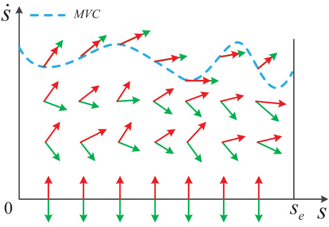  
Fig. 1. Upper and lower limits of path acceleration    $\ddot{s}$   on the plane  $(s,\dot{s})$  : red arrows represent upper limits and green arrows represent lower limits. The symbol  $s_{e}$   is the total length of a specified path.  

provided in Section IV. The detailed application examples on manipulators and OWMRs are provided in Section V. Simula- tion and experimental results are provided in Section VI. Some conclusions are given in Section VII.  

# II. R ELATED  W ORKS ON  NI  WITH  T ORQUE AND V ELOCITY  C ONSTRAINTS  

# A. NI with Torque Constraints  

In original NI [18], [19] with only torque constraints, along a specified path, the robot model is parameterized by    $s(t)$   instead of time  $t$  , with    $s$   being the path coordinate on the given path. Accordingly, the time-optimal trajectory planning is simplified as a planning problem in two dimensional path parameteriza- tion space    $(s,\dot{s})$  , with  $\dot{s}=d s/d t$   being the path velocity. Then, torque constraints of robotic systems are formulated as an in- equality in terms of  $s,\dot{s},\ddot{s}$   as follows:  

$$
\alpha(s,\dot{s})\leq\ddot{s}\leq\beta(s,\dot{s})
$$  

where    $\ddot{s}$   is the path acceleration,    $\alpha(s,\dot{s})$   and  $\beta(s,\dot{s})$   denote the minimum path acceleration and maximum path acceleration, respectively. The path acceleration    $\ddot{s}=\alpha(s,\dot{s})$   or    $\ddot{s}=\beta(s,\dot{s})$  indicates that some of actuators touch torque bounds. The more detailed description of (1) can be found in [12]. On the phase plane    $(s,\dot{s})$  ,    $\alpha(s,\dot{s})$  ,  and  $\beta(s,\dot{s})$   are depicted as a pair of arrows as shown in  Fig. 1 . The cyan dash line represents maximum velocity curve (MVC), where all pairs of arrows close. The core of NI is the computation of switch points on MVC, which in- clude tangent, discontinuity and zero-inertia points [20]–[22],

 [32]. From the starting point    $(s=0,\dot{s}=\dot{s}_{0})$  ) , terminal point

  $(s=s_{e},\dot{s}=\dot{s}_{e}$  )  and these switch points, accelerating curves are integrated forward with maximum path acceleration  $\beta(s,\dot{s})$  (red solid curves  $\beta_{1},\beta_{2}$   in  Fig. 2 ), and decelerating curves are integrated backward with minimum path acceleration    $\alpha(s,\dot{s})$  (green solid curves    $\alpha_{1},\alpha_{2}$   in  Fig. 2 ). Finally, these accelerat- ing and decelerating curves constitute a time-optimal velocity profile on the plane    $(s,\dot{s})$  . In this paper, the terms “minimum path acceleration” and “maximum path deceleration” have the same meaning of the lower bound for path acceleration  ¨ . In addition, as lower and upper bounds of   s ,    $\alpha(s,\dot{s})$  ,  and    $\beta(s,\dot{s})$  may possess the same sign, which has been mentioned in [18] and [19].  

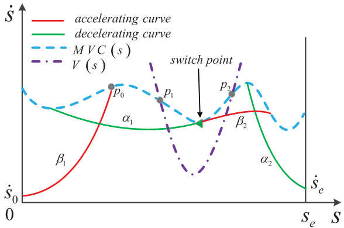  
Fig. 2. Failure case: when velocity constraints are considered, the orig- inal version of NI with torque constraints fails to output a feasible velocity profile. The symbols  ${\dot{s}}_{0},{\dot{s}}_{e}$   are, respectively, starting path velocity and terminal path velocity. The cyan dash line represents the limit curve with torque constraints, and the purple dash-dot line is the limit curve with velocity constraints.  

# B. NI With Torque and Velocity Constraints  

The original NI generates a time-optimal velocity profile with only torque constraints. Yet, when velocity constraints are also considered, it may fail to output a feasible trajectory [10]–[12]. The concrete failure conditions are provided with detailed math- ematical proofs in [12]. Specifically, due to velocity constraints  $V(s)$  , the MVC is altered as  

$$
\mathbf{M V C}^{*}(s)=\operatorname*{min}{\left(\mathbf{M V C}\left(s\right),V(s)\right)},\,\,\,s\in[0,s_{e}]
$$  

where    $s_{e}$   is the total length of the given path. In addition, the part of  $\mathbf{M}\mathbf{V}\mathbf{C}^{*}$  , which is different from MVC, is described as  

$$
\mathbf{M V C}^{\dagger}(s)=\{\mathbf{M V C}^{*}(s)|\mathbf{M V C}^{*}(s){<}\mathbf{M V C}(s),s\in[0,s_{e}]\}.
$$  

For instance, the purple dash-dot curve  $\widehat{p_{1}p_{2}}$   is  $\mathbf{M}\mathbf{V}\mathbf{C}^{\dagger}$    in  Fig. 2 . It is shown that, switch points are nonexistent on  $\mathbf{M}\mathbf{V}\mathbf{C}^{\dagger}$  , thus it breaks the intersection between the accelerating and decelerat- ing curves, which results in failure of trajectory planning tasks for the original NI with only torque constraints.  

In order to generate feasible velocity profiles under torque/acceleration and velocity constraints, the works in [10] and [11] provide some solutions. The trap regions on the plane  $(s,\dot{s})$   are discovered in the method [10]. On this basis, the method generates feasible velocity profiles under torque and velocity constraints, and it has been implemented in the codes [22]. The method in [11] requires  two  searching stages to gener- ate feasible velocity profiles: first, it searches switch points along the given path and outputs one feasible velocity profile that only satisfies acceleration constraints; second, taking into account the obtained feasible velocity profile from the first search, together with the velocity constraint curve, it searches velocity character- istic points along the given path again, then a feasible velocity profile is generated. Recently, the work in [38] provides the prob- abilistic completeness proofs of the “AVP-RRT” method with torque constraints for a kinodynamic motion planning problem, wherein the trajectory planning part uses the approach in [10], yet the completeness of the method [10] is not guaranteed.  

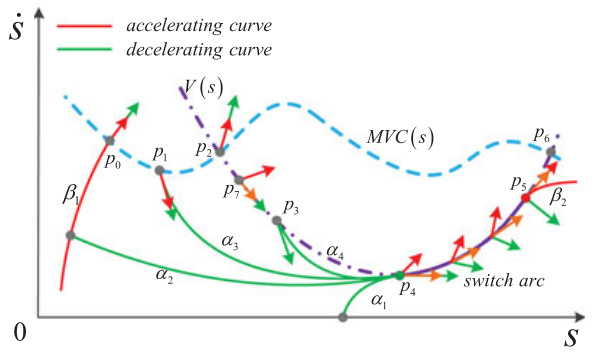  
Fig. 3. From the intersection point  $p_{0}$   of  $\beta_{1}$   and  $\mathsf{M V C}^{*}$  , the switch arc  $\widehat{p_{4}p_{5}}$   is the first one found among switch points and switch arcs forward along  $\mathsf{M V C}^{*}$  . The curves  $\alpha_{1}$  ,  $\alpha_{2},\alpha_{3}$  ,  $\mathsf{a n d}\alpha_{4}$   are all possible decelerating curves from  $p_{4}$  . The cyan dash and purple dash-dot curves are, respec- tively,  $\mathsf{M V C}(s)$   with only torque constraints and    $V(s)$   with only velocity constraints. The slope of red arrows represents maximum path acceler- ation  $\beta(s,\dot{s})$  . The slope of green arrows represents minimum path accel- eration  $\alpha(s,\dot{s})$  . The slope of orange arrows represents path acceleration ¨  of MVC †   (purple dash-dot curve  ${\widehat{p_{2}p_{6}}}$  ).  

From the above-mentioned analysis, there is still a lack of a complete and TOPCTP algorithm under both torque and velocity constraints, which is explored in this paper.  

# III. C OMPLETE AND  T IME -O PTIMAL  T RAJECTORY  P LANNING  

In this section, a novel concept of “switch arc” is defined on the part of the curve  $\mathbf{M}\mathbf{V}\mathbf{C}^{\dagger}(s)$  . With the aid of an appealing property of integrated backward decelerating curves from switch arcs, the CTOA-TV is proposed, which could guarantee the completeness and time optimality.  

# A. Switch Arc  

Definition 1:  A switch arc is a continuous segment of MVC (3) that satisfies path acceleration constraints (1).  

Satisfying path acceleration constraints (1) indicates that, for any point lying on a switch arc, the slope    $\ddot{s}$   of the tangent line to  $\mathbf{M}\mathbf{V}\mathbf{C}^{\dagger}$    is between the slopes    $[\alpha(s,\dot{s}),\beta(s,\dot{s})]$  . As shown in Fig. 3 , orange arrows tangent to   $\mathbf{M}\mathbf{V}\mathbf{C}^{\dagger}$    are between green and red arrows on the switch arc (purple solid  ${\widehat{p_{4}p_{5}}}.$  ).  

It is noted that many switch arcs may exist on the curve  $\mathbf{M}\mathbf{V}\mathbf{C}^{\dagger}$  . In addition, the switch arc may degenerate into a single point at which path acceleration constraints are guaranteed.  

Property 1:  From the intersection point of one accelerating curve and   $\mathbf{M}\mathbf{V}\mathbf{C}^{*}$  , if a switch arc is the first one found among switch points and switch arcs forward along  $\mathbf{M}\mathbf{V}\mathbf{C}^{*}$  , then from its left endpoint, the integrated backward decelerating curve intersects one of lines: the previous accelerating curve,  $\dot{s}=0$   0, and  $s=0$   with  $\dot{s}\!<\!\dot{s}_{0}$  .  

Proof:  As shown in  Fig. 3 , from the intersection point    $p_{0}$   of  $\beta_{1}$   and   $\mathbf{M}\mathbf{V}\mathbf{C}^{*}$  , the switch arc  $\widehat{p_{4}p_{5}}$   is the first one found among switch points and switch arcs forward along  $\mathbf{M}\mathbf{V}\mathbf{C}^{*}$  . Then, from the left endpoint  $p_{4}$   of  $\widehat{p_{4}p_{5}}$  , all possible integrated backward decelerating curves are described as follows.  

Case 1:  The decelerating curve   $(\alpha_{1})$   intersects the line  $\dot{s}=0$   0, or the line  $s=0$   with  $\dot{s}\!<\!\dot{s}_{0}$  .  

Case 2:  The decelerating curve   $(\alpha_{2})$   intersects the previous accelerating curve.  

Case 3:  The decelerating curve (  $[\alpha_{3}$   or  $\alpha_{4}$  ) intersects   $\mathbf{M}\mathbf{V}\mathbf{C}^{*}$  . In the following, we will prove that Case 3 cannot occur by contradiction. Assume that Case 3 occurs. Then, the integrated backward decelerating curve    $\alpha^{*}$  from  $p_{4}$   is one of    $\alpha_{3},\alpha_{4}$  .  

When  $\alpha^{*}$  is  $\alpha_{3}$  , there exists at least one switch point on  $\widehat{p_{0}p_{1}}$  due to the continuity of the slope of red and green arrows [38]. It contradicts with the condition that the switch arc  $\widehat{p_{4}p_{5}}$   is first found along  $\mathbf{M}\mathbf{V}\mathbf{C}^{*}$  from  $p_{0}$  .  

When    $\alpha^{*}$  is    $\alpha_{4}$  , the green arrow at  $p_{3}$   is below  $\mathbf{M}\mathbf{V}\mathbf{C}^{\dagger}$    (the purple dash-dot curve  $\widehat{p_{2}p_{6}})$  ). The red and green arrows at  $p_{2}$  exceed MVC, otherwise, there exists at least one switch point on  $\widehat{p_{0}p_{2}}$  , which contradicts with the given condition. Based on the definition of  $\mathbf{M}\mathbf{V}\mathbf{C}^{\dagger}$    in (2), MVC †   is below MVC, which indicates that the red and green arrows exceed   $\mathbf{M}\mathbf{V}\mathbf{C}^{\dagger}$    at    $p_{2}$  . Since the slope of green arrows is continuous, there exists at least one point  $p_{7}$   on  $\widehat{p_{2}p_{3}}$  , where the green arrow is tangent to  $\mathbf{M}\mathbf{V}\mathbf{C}^{\dagger}$  . Moreover, red and green arrows cannot close at    $p_{7}$   as shown in  Fig. 1 , which indicates that the slope of the orange tangent arrow to  $\mathbf{M}\mathbf{V}\mathbf{C}^{\dagger}$    satisfies the inequality constraints (1) at  $p_{7}$  . Thus,  $p_{7}$   is the point of another switch arc on  $\mathbf{M}\mathbf{V}\mathbf{C}^{\dagger}$  , which contradicts with the condition that the switch arc  $\widehat{p_{4}p_{5}}$   is first found along  $\mathbf{M}\mathbf{V}\mathbf{C}^{*}$  from  $p_{0}$  . Note that  $\alpha^{*}$  may hit  $\mathbf{M}\mathbf{V}\mathbf{C}^{*}$  at    $p_{4}$  immediately, and its analysis is same with  $\alpha_{4}$  .  

From the above-mentioned analysis, this assumption is in- valid, and Case 3 cannot occur. Therefore, Case 1 and Case 2 possibly occur for the integrated backward decelerating curve from the left endpoint of the switch arc. ■  

Remark 1:  Property 1 still holds, if the first found switch arc degenerates into one point where (1) is guaranteed. In addition, if the terminal point    $\acute{s}=s_{e}\,,\dot{s}=\dot{s}_{e}$  )  or a switch point on  $\mathbf{M}\mathbf{V}\mathbf{C}^{\dagger}$  is first found instead of switch arcs, Property 1 also holds. The corresponding proof is similar with the above-mentioned pro- cedure. In addition, it has been proven that from switch points on MVC with only torque constraints, integrated backward de- celerating curves cannot intersect MVC in [38]. ■  

# B. Algorithm Procedure  

Based on the switch arc in  Definition 1 , detailed procedures of the proposed approach are given in Algorithm 1. The output arguments include “failure” and “solution,” wherein the failure indicates that there is no physically feasible velocity profile for TOPCTP, while the solution consisting of accelerating curves, decelerating curves, and switch arcs, represents a time-optimal velocity profile under torque and velocity constraints. The sub- functions are described as.  

1)  accProfile  $(p)$   calculates one accelerating curve by for- ward direction integral with maximum path acceleration  $\beta(s,\dot{s})$   from  $p$   or the right endpoint of  $p$   if  $p$   is a switch arc, until the accelerating curve hits one of lines:  $\mathbf{M}\mathbf{V}\mathbf{C}^{*}$  ,  $\dot{s}=0$   0 and  $s=s_{e}$  . The hitting point is returned. 2)  decProfile  $(p)$   calculates one decelerating curve by backward direction integral with minimum path accel- eration    $\alpha(s,\dot{s})$   from  $p$   or the left endpoint of    $p$   if    $p$   is a switch arc, until the decelerating curve hits one of lines:  

Algorithm 1:  A Complete and Time-Optimal Algorithm with Torque and Velocity Constraints (CTOA-TV).  

Input:  $s_{e}$  ,  $\dot{s}_{0}$  ,  $\dot{s}_{e}$  , MVC ∗ . Output:  a solution or failure. 1:    $p\gets(0,\dot{s}_{0})$  2:    $h\leftarrow a c c P r o f i l e(p)$  3:  if  h  is in one of lines:  $\dot{s}=0$   0,    $s=s_{e}$   with  $\dot{s}\!<\!\dot{s}_{e}$   then 4: return  failure 5:  else if  $h$   is in the line    $s=s_{e}$   with  $\dot{s}\geq\dot{s}_{e}$   ≥  then 6:  $p\gets(s_{e},\dot{s}_{e})$   and  go to 17 7:  else if  h  is in a switch arc  then 8:  $p\gets$  the right endpoint of the switch arc, and  go to 2 9:  else 10:  $s\gets s e a r c h S w i t c h(h,\mathbf{M V C}^{*})$  11: if  $s$   is NULL  then 12:  $p\gets(s_{e},\dot{s}_{e})$  13: else 14:  $p\gets s$  15: end if 16:  end if 17:    $h\leftarrow d e c P r o f i l e(p)$  18:  if  h  is in one of lines:  $\dot{s}=0$   0,  $s=0$   with  $\dot{s}\!<\!\dot{s}_{0}$   then 19: return  failure 20:  else if  $p$   is    $(s_{e},\dot{s}_{e})$   then 21: return  solution 22:  else 23: go to 2 24:  end if  

$\dot{s}=0,\;s=0$   with  $\dot{s}\!<\!\dot{s}_{0}$  , and the previously generated accelerating curve. The hitting point is returned.  

3)  searchSwitch  $(h,\mathbf{M}\mathbf{V}\mathbf{C}^{*})$   searches forward the first switch point or switch arc along   $\mathbf{M}\mathbf{V}\mathbf{C}^{*}$  from the point    $h$  . If some switch points or switch arcs are found, then the first detected one (the most left one searching from    $h$  ) is returned, otherwise NULL is returned.  

Remark 2:  In   $\mathrm{C++}$   implementation of the proposed ap- proach, three subfunctions are called in sequence to do sim- ple numerical computation along the given path that is di- vided into    $n$   pieces. Suppose there exists a constant    $T$  such that the computational time of each subfunction at each discrete point less than or equal to    $T$  . The point sets  $P_{\mathrm{acc}},P_{\mathrm{dec}},P_{\mathrm{switch}}$   consist of discrete points where subfunctions accProfile, decProfile, switchSearch  are recalled, respec- tively.  accProfile  and  searchSwitch  both do computation forward  along the given path. Moreover, the starting point of  $P_{\mathrm{acc}}$   is the terminal point of    $P_{\mathrm{{swarrow}}}$   in term of the line 2–10 in Algorithm 1. Thus,  $P_{\mathrm{acc}}$   and    $P_{\mathrm{{swarrow}}}$   have no overlapped parts. However,  decProfile  does computation  backward  along the given path, thus  $P_{\mathrm{dec}}$   may be overlapped with    $P_{\mathrm{acc}}$   or    $P_{\mathrm{{swarrow}}}$  . From the above-mentioned analysis, a solution or failure will be returned by the proposed approach in a fast and finite com- putational time    $\delta\cdot n\cdot T$   with  $\delta\in[1,2]$  . In addition, the lines 18 and 19 in Algorithm 1 show that Case 1 in proof of Property 1 is one sufficient condition for the failure of TOPCTP. ■  

# IV. T IME  O PTIMALITY AND  C OMPLETENESS  

In this section, based on Property 1 of switch arcs, it is proven that the generated velocity profiles by the proposed approach are time-optimal. Then, we give sufficient and necessary con- ditions with mathematical proofs for the proposed approach to generate time-optimal velocity profiles under both torque and velocity constraints. Furthermore, it is proven that under torque and velocity constraints, the proposed approach is complete for TOPCTP.  

# A. Time Optimality  

Under torque and velocity constraints, the obtained solution by Algorithm 1 consists of switch arcs, accelerating curves, and decelerating curves. In this section, the following theorem is presented to prove the optimality of the solution.  

Theorem 1:  Under both torque and velocity constraints, the solution generated by the proposed CTOA-TV in Algorithm 1 is time-optimal.  

Proof:  This theorem is proven by contradiction. It is assumed that on the plane    $(s,\dot{s})$   the solution    $\Phi(s)$   generated by CTOA- TV is not time-optimal from the starting point    $(0,\dot{s}_{0})$   to the terminal point    $(s_{e},\dot{s}_{e})$  , while    $\Psi(s)$   is the optimal trajectory. Then, along the given path, there exists at least one  $s=s^{*}$  where  $\Psi(s^{*})>\Phi(s^{*})$   holds. If    $\Phi(s)$   is accelerating at    $s^{*}$  , then in order to reach    $(s^{*},\Psi(s^{*}))$  ,    $\Psi(s)$   must be accelerating before  $s^{*}$  with the path acceleration    $\beta^{\prime}(s,\dot{s})$   that is greater than  $\beta(s,\dot{s})$   in (1). It contradicts with the definition of maximum path acceleration

  $\beta(s,\dot{s})$  . If    $\Phi(s)$   is decelerating at    $s^{*}$  , then in order to leave

  $(s^{*},\Psi(s^{*}))$   for    $(s_{e},\Psi(s_{e}))$  ,    $\Psi(s)$   must be decelerating after    $s^{*}$  with the path acceleration  $\alpha^{\prime}(s,\dot{s})$   that is less than  $\alpha(s,\dot{s})$   in (1). It contradicts with the definition of minimum path acceleration

  $\alpha(s,\dot{s})$  . If    $\Phi(s)$   is in a switch arc at    $s^{*}$  , then    $\Psi(s)$   is beyond

  $\mathbf{M}\mathbf{V}\mathbf{C}^{*}$  at    $s^{*}$  . It contradicts with torque and velocity constraints represented by  $\mathbf{M}\mathbf{V}\mathbf{C}^{*}$  . Therefore, this assumption is invalid, and  $\Phi(s)$   is time-optimal. ■  

# B. Feasibility Conditions and Completeness  

We first present Theorem 2 to show working conditions of the proposed approach under torque and velocity constraints. On the basis of Theorem 2, we give the detailed proof on completeness of this approach in Theorem 3.  

Theorem 2:  The sufficient and necessary conditions of the proposed CTOA-TV in Algorithm 1 to generate a time-optimal velocity profile under torque and velocity constraints are given as follows.  

$C_{1}$  :  Starting from    $(s=0,\dot{s}=\dot{s}_{0})$  ) , switch points and right endpoints of switch arcs, all integrated forward accelerating curves do not hit the line  $\dot{s}=0$   0 and the line  $s=s_{e}$   with  $\dot{s}\!<\!\dot{s}_{e}$  .  

$C_{2}$  :  Starting from    $(s=s_{e},\dot{s}=\dot{s}_{e}$  ) , switch points and left endpoints of switch arcs, all integrated backward decelerating curves do not hit the line  $\dot{s}=0$   0 and the line  $s=0$   with  $\dot{s}\!<\!\dot{s}_{0}$  .  

Proof:  ( Sufficiency ) In order to prove sufficiency, we analyze procedures of CTOA-TV when both conditions  $C_{1},C_{2}$   hold, and it is shown that this algorithm outputs a time-optimal velocity profile    $\Phi(s)$   with torque and velocity constraints. According to    $C_{1}$  , from the starting point    $(s=0,\dot{s}=\dot{s}_{0})$  ) , the integrated  

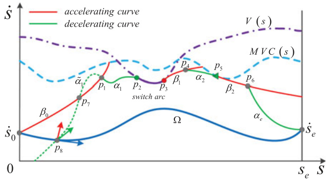  
Fig. 4. Proposed approach outputs a time-optimal velocity profile un- der torque and velocity constraints, which consists of red solid curves  $(\beta_{0},\beta_{1},\overset{\cdot}{\beta}_{2})$  , green solid curves   $(\alpha_{1},\alpha_{2},\alpha_{e})$  , and the purple solid curve  $\widehat{p_{2}p_{3}}$  . The cyan dash and purple dash-dot curves are, respectively,  $\mathsf{M V C}(s)$   with only torque constraints and    $V(s)$   with only velocity con- straints. Note that the green dot curve  $\tilde{\alpha}_{1}$   and blue solid curve    $\Omega$   are only used in the proofs of Theorem 3 and necessity in Theorem 2.  $\tilde{\alpha}_{1}$  represents the backward extended part of  $\alpha_{1}$  , and  $\Omega$   represents one pos- sible time-optimal velocity profile for TOPCTP under torque and velocity constraints.  

forward accelerating curve in  accProfile  hits either   $\mathbf{M}\mathbf{V}\mathbf{C}^{*}$  or the line    $s=s_{e}$   with  $\dot{s}\geq\dot{s}_{e}$   ≥ . If the line    $s=s_{e}$   with    $\dot{s}\geq\dot{s}_{e}$   ≥  is hit, then  decProfile  is called. In term of    $C_{2}$   and Property 1, the integrated backward decelerating curve from the terminal point    $\left(s=s_{e},\dot{s}=\dot{s}_{e}\right)$  )  intersects the previously generated ac- celerating curve, and the algorithm outputs    $\Phi(s)$  . If the curve  $\mathbf{M}\mathbf{V}\mathbf{C}^{*}$  is hit, then the hitting point is within a switch arc or not. For this hitting point being in the switch arc, starting from the right endpoint of the switch arc, one new accelerating curve is integrated forward in  accProfile . For this hitting point being not in the switch arc,  searchSwitch  is called to search forward the first one among switch points and switch arcs along MVC ∗ from the hitting point. When the first one is found,  decProfile is called to generate one decelerating curve that intersects the previously generated accelerating curve due to  $C_{2}$   and Property 1, and  accProfile  is called to generate one new accelerating curve. When no one is found, the integrated backward decel- erating curve from    $(s=s_{e},\dot{s}=\dot{s}_{e}$  )  in  decProfile  intersects the previously generated accelerating curve to output    $\Phi(s)$  . For instance,  Fig. 4  shows one case of the above-mentioned proce- dures, wherein    $\Phi(s)$   consists of the switch arc  $\widehat{p_{2}p_{3}}$  , accelerating curves    $(\beta_{0},\beta_{1},\beta_{2})$   and decelerating curves    $\left(\alpha_{1},\alpha_{2},\alpha_{e}\right)$  . From the above-mentioned analysis, sufficiency is proven.  

( Necessity ) We prove necessity by contradiction. CTOA-TV outputs a time-optimal velocity profile    $\Phi(s)$   with torque and velocity constraints. This velocity profile satisfies path acceler- ation constraints (1), and it consists of accelerating curves, de- celerating curves, and switch arcs. It is assumed that one of con- ditions    $C_{1},C_{2}$   does not hold. If  $C_{1}$   is violated, then in order to hit the line  $\dot{s}=0$   0 or the line  $s=s_{e}$   with  $\dot{s}\!<\!\dot{s}_{e}$  , there exists at least one integrated forward accelerating curve from    $(s=0,\dot{s}=\dot{s}_{0})$  ) , switch points and right endpoints of switch arcs, which intersects  $\Phi(s)$  . If  $C_{2}$   is violated, then in order to hit the line  $\dot{s}=0$   0 or the line  $s=0$   with  $\dot{s}\!<\!\dot{s}_{0}$  , there exists at least one integrated back- ward decelerating curve from    $(s=s_{e}\,,\dot{s}=\dot{s}_{e}$  ) , switch points and left endpoints of switch arcs, which intersects    $\Phi(s)$  . At these intersection points, the path acceleration of    $\Phi(s)$   violates path constraints (1), which contradicts with    $\Phi(s)$   satisfying (1). Therefore, this assumption is invalid, and both conditions    $C_{1},C_{2}$  hold. For instance, as shown in  Fig. 4 , under torque and veloc- ity constraints, this algorithm outputs a time-optimal velocity profile    $\beta_{0}-\alpha_{1}-\widehat{p_{2}p_{3}}-\beta_{1}-\alpha_{2}-\beta_{2}-\alpha_{e}$   −  −  −  − arting from  $p_{2}$  , the integrated backward decelerating curve  ˜  (the backward extended part of  $\alpha_{1}$  ) intersects    $\beta_{0}$   at  $p_{7}$   if    $C_{2}$   is violated. At  $p_{7}$  , the slope of the accelerating curve  $\beta_{0}$   is less than the slope of the decelerating curve  $\tilde{\alpha_{1}}$  , which indicates that (1) is violated. From the above-mentioned analysis, necessity is proven. In summary, this theorem is proven. ■  

Remark 3:  The conditions    $C_{1},C_{2}$   in Theorem 2 have straightforward physical interpretations. The    $C_{1}$   indicates that along the given path, the given  $\dot{s}_{0}$   is too slow to reach the given  $\dot{s}_{e}$   despite of maximum path acceleration  $\beta(s,\dot{s})$  . The  $C_{2}$   indi- cates that along the given path, the given  $\dot{s}_{0}$   is too fast to reach the given  $\dot{s}_{e}$   despite of minimum path acceleration  $\alpha(s,\dot{s})$  . ■  

Based on Theorem 2, the completeness of the proposed ap- proach for TOPCTP is proven as follows.  

Theorem 3:  Under torque and velocity constraints, the pro- posed CTOA-TV in Algorithm 1 is complete for TOPCTP.  

Proof:  In robot motion planning, an algorithm is complete for a problem when the following two conditions hold [35]:  

1) a solution is returned if one exists; and 2) failure is returned in a finite time otherwise.  

As shown in  Fig. 4 , under torque and velocity constraints, for TOPCTP, if a time-optimal velocity profile    $\Omega$   exists, then this profile satisfies path acceleration constraints (1), and    $\Omega$   is a continuous curve between    $(0,\dot{s}_{0})$   and    $(s_{e},\dot{s}_{e})$   that is enclosed by the lines:  $\mathbf{M}\mathbf{V}\mathbf{C}^{*}$  ,    $s=0$  ,  $s=s_{e}$  ,  and  $\dot{s}=0$   0. All of switch points, switch arcs, starting point    $(0,\dot{s}_{0})$  ,  and terminal point  $(s_{e},\dot{s}_{e})$   are on  $\Omega$   or above  $\Omega$  . It is assumed that one of conditions  $C_{1},C_{2}$   does not hold. If    $C_{1}$   is violated, then, starting from    $(s=0,\dot{s}=\dot{s}_{0})$  ) , switch points and right endpoints of switch arcs, there exists at least one integrated forward accelerating curve that intersects

  $\Omega$  , in order to hit one of lines below    $\Omega$  :  $\dot{s}=0$   0, and    $s=s_{e}$   with

  $\dot{s}\!<\!\dot{s}_{e}$  . If    $C_{2}$   is violated, then starting from    $\left(s=s_{e},\dot{s}=\dot{s}_{e}\right)$  ) , switch points and left endpoints of switch arcs, there exists at least one integrated backward decelerating curve that intersects

  $\Omega$  , in order to hit one of lines below    $\Omega$  :  $\dot{s}=0$   0, and  $s=0$   with

  $\dot{s}\!<\!\dot{s}_{0}$  . At these intersection points, the path acceleration of    $\Omega$  violates path acceleration constraints (1), which indicates that the assumption is invalid and both conditions  $C_{1},C_{2}$   hold if a solution exists for TOPCTP. Based on sufficiency in Theorem 2, a time-optimal velocity profile is returned by CTOA-TV. From these analysis, the condition 1) holds.  

As described in Remark 2, a time-optimal velocity profile or failure is obtained by CTOA-TV in a finite time. Therefore, if there is no feasible velocity profile for TOPCTP under torque and velocity constraints, then CTOA-TV will return failure in a finite time. The condition 2) holds. ■  

# V. A PPLICATIONS  

This section provides two application examples of the pro- posed approach on a two-link manipulator and an active-caster- based OWMR.  

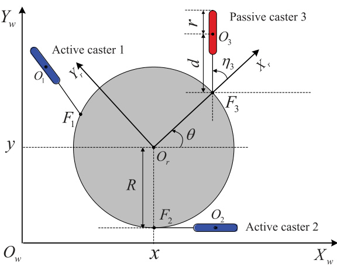  
Fig. 5. OWMR with two blue active casters and one red passive caster.  

# A. Omnidirectional Wheeled Mobile Robot  

Omnidirectional wheeled mobile robots with active casters possess high degree of maneuverability [39], [40]. In  Fig. 5 , the vehicle has three casters: one passive caster and two active casters.    ${\mathcal{F}}(X_{r}O_{r}Y_{r})$   and    $\mathcal{F}(X_{w}\,O_{w}\,Y_{w}\,)$   represent the robot co- ordinate system and reference coordinate system, respectively.  $R\in\mathbb{R}^{+}$    represents the radius o ot frame.  $r\in\mathbb{R}^{+}$    stands for the radius of    $d\in\mathbb{R}^{+}$   ∈   st s for the length of the steering li  $F_{i}O_{i}$  i ,  $i\in[1,3]$    , wherein  $O_{i}$   is the center int of the wh  $x\in\mathbb{R}$   ∈  and  y  $y\in\mathbb R$   ∈  represent the position of  $O_{r}$   in  $\mathcal{F}_{w}$  , with  $\theta\in\mathbb{S}$   ∈  being the robot orientation. The angles of three casters  $\eta_{i}\in\mathbb{S}$   are the angles from    $O_{r}F_{i}$   to  $F_{i}O_{i},i\in[1,3]$  , with anticlockwise being positive.  

The kinematic model of the vehicle [39] is described as  

$$
\pmb{\omega}=J\dot{\pmb\xi}
$$  

$$
{\mathbf{\nabla}}a={\dot{\omega}}
$$  

ein the vector    $\pmb{\xi}\in\mathbb{R}^{3}$    is the pose of the vehicle, and the  $4\times1$   ×  1 vectors  $\omega,a$   are the velocity and acceleration of active casters, respectively. Other variables are described as  

$$
{\pmb\xi}=[x\ y\ \theta]^{\mathrm{T}}
$$  

$$
\begin{array}{r l}&{J=\left[J,\,J,\,J_{z},\,J_{\tau}\right]^{\top}}\\ &{J_{z}=}\\ &{\left[\frac{-\cos(\theta+\eta_{l}+2\pi/3)}{r}\,\frac{-\sin(\theta+\eta_{l}+2\pi/3)}{r}\,\frac{-R\sin(\eta_{l})}{r}\right]^{\top}}\\ &{J_{z}=}\\ &{\left[\frac{\sin(\theta+\eta_{l}+2\pi/3)}{r}\,\frac{-\cos(\theta+\eta_{l}+2\pi/3)}{d}\,\frac{-d-R\cos(\eta_{l})}{d}\right]^{\top}}\\ &{J_{y}=}\\ &{\left[\frac{-\cos(\theta+\eta_{l}-2\pi/3)}{r}\,\frac{-\sin(\theta+\eta_{l}-2\pi/3)}{r}\,\frac{-R\sin(\eta_{l})}{r}\right]^{\top}}\\ &{J_{z}=}\\ &{\left[\frac{\sin(\theta+\eta_{l}-2\pi/3)}{d}\,\frac{-\cos(\theta+\eta_{l}-2\pi/3)}{d}\,\frac{-d-R\cos(\eta_{l})}{d}\right]^{\top}}\end{array}
$$  

Along the specified path, the pose of the vehicle is represented as  $\xi(s)$  . Taking the time derivative of  $\xi(s)$   yields that  

$$
\begin{array}{r l}&{\dot{\pmb{\xi}}=\pmb{\xi}_{s}\dot{s}}\\ &{\pmb{\xi}_{s}=[x_{s}~y_{s}~\theta_{s}]^{\mathrm{T}}}\end{array}
$$  

where    $x_{s}=d x/d s,y_{s}=d y/d s$  ,  and    $\theta_{s}=d\theta/d s$  . Substituting (6) and (7) into (4) and (5), we obtain  

$$
\begin{array}{l}{{\pmb{\omega}=J\pmb{\xi}_{s}\dot{s}}}\\ {{\pmb{a}=J\pmb{\xi}_{s}\ddot{s}+\big(J^{\dagger}\pmb{\xi}_{s}+J\pmb{\xi}_{s s}\big)\dot{s}^{2}}}\end{array}
$$  

where    $\pmb{\xi}_{s s}=\partial\pmb{\xi}_{s}/\partial s$  , and the  $4\times3$   matrix    $J^{\dagger}=\partial J/\partial s$  . During the motion along the specified path, due to nonholo- nomic constraints of each active caster, there are only two possi- ble angles for each active caster:  $\eta_{i}$   or    $\eta_{i}+\pi$  . The angles  $\eta_{1},\eta_{2}$  are computed as  

$$
\begin{array}{r}{\eta_{1}=\mathrm{atan2}\big(\!-y_{s}-R\theta_{s}\mathrm{cos}\big(\theta+2\pi/3\big),-x_{s}}\\ {+\ R\theta_{s}\mathrm{sin}\big(\theta+2\pi/3\big)\big)-\theta-2\pi/3\ }\\ {\eta_{2}=\mathrm{atan2}\big(\!-y_{s}-R\theta_{s}\mathrm{cos}\big(\theta-2\pi/3\big),-x_{s}}\\ {+\ R\theta_{s}\mathrm{sin}\big(\theta-2\pi/3\big)\big)-\theta+2\pi/3.\ }\end{array}
$$  

Because of the stabilizability of active casters in the motion [40], the angles  $\eta_{1},\eta_{2}$   are chosen. In addition, initial angles of active casters at the starting pose with  $s=0$   are arbitrary. However, for convenience, we suppose that the initial angles of active casters equal to  $\eta_{1},\eta_{2}$   in (10) and (11) with    $s=0$  . Velocity and acceleration constraints of active casters are given as  

$$
\begin{array}{r l}&{-\omega_{\mathrm{\tiny~max}}\leq\omega\leq\omega_{\mathrm{\tiny~max}}}\\ &{-a_{\mathrm{\tiny~max}}\leq a\leq a_{\mathrm{\tiny~max}}}\end{array}
$$  

where    $\omega_{\mathrm{max}}$  ,    $\pmb{a}_{\mathrm{max}}\in\mathbb{R}^{4}$  . In order to satisfy acceleration con- straints, substituting (9) into (13) yields that  

$$
A(s){\ddot{s}}+B(s){\dot{s}}^{2}+C(s)\leq{\bf0}
$$  

with  

$$
\begin{array}{r l}&{\pmb{A}(s)=[(J\pmb{\xi}_{s})^{\mathrm{T}}\ \ (-J\pmb{\xi}_{s})^{\mathrm{T}}]^{\mathrm{T}}}\\ &{\pmb{B}(s)=[(J^{\dagger}\pmb{\xi}_{s}+J\pmb{\xi}_{s s})^{\mathrm{T}}\ \ (-J^{\dagger}\pmb{\xi}_{s}-J\pmb{\xi}_{s s})^{\mathrm{T}}]^{\mathrm{T}}}\\ &{\pmb{C}(s)=[-\pmb{a}_{\operatorname*{max}}^{\mathrm{T}}\ -\pmb{a}_{\operatorname*{max}}^{\mathrm{T}}]^{\mathrm{T}}.}\end{array}
$$  

Then, according to (14), on the plane    $(s,\dot{s})$  , the limits of path acceleration  $\ddot{s}$   are computed as  

$$
\begin{array}{r l}&{\alpha(s,\dot{s})=\operatorname*{max}\left\{\displaystyle\frac{-B_{i}(s)\dot{s}^{2}-C_{i}(s)}{A_{i}(s)}|A_{i}(s)\!<\!0,i\in[1,8]\right\}}\\ &{\beta(s,\dot{s})=\operatorname*{min}\left\{\displaystyle\frac{-B_{i}(s)\dot{s}^{2}-C_{i}(s)}{A_{i}(s)}|A_{i}(s)>0,i\in[1,8]\right\}.}\end{array}
$$  

In terms of  $\alpha(s,\dot{s})$   and  $\beta(s,\dot{s})$  ) , the velocity limit curve with acceleration constraints is computed as  

$$
\begin{array}{r}{\mathbf{M V C}(s)=\operatorname*{min}\{\dot{s}\geq0|\alpha(s,\dot{s})=\beta(s,\dot{s})\}.}\end{array}
$$  

In order to satisfy velocity constraints, substituting (8) into (12) yields that  

$$
A(s)\dot{s}+D(s)\leq{\bf0}
$$  

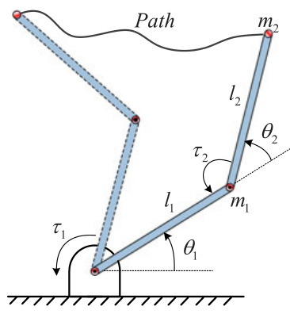  
Fig. 6. End-effector motion of a two-link manipulator along a given path.  

with  

$$
\begin{array}{r l}&{A(s)=[(J\pmb{\xi}_{s})^{\mathrm{T}}\,\,\,(-J\pmb{\xi}_{s})^{\mathrm{T}}]^{\mathrm{T}}}\\ &{D(s)=[-\pmb{\omega}_{\operatorname*{max}}^{\mathrm{T}}\,\,-\pmb{\omega}_{\operatorname*{max}}^{\mathrm{T}}]^{\mathrm{T}}\,.}\end{array}
$$  

According to (16), the velocity limit curve with velocity con- straints is computed as  

$$
V(s)=\operatorname*{min}\{-D_{i}(s)/A_{i}(s)|A_{i}(s)>0,i\in[1,8]\}.
$$  

Finally, substituting (15) and (17) into (2) yields the  $\mathbf{M}\mathbf{V}\mathbf{C}^{*}$  . With these  $\alpha(s,\dot{s}),\beta(s,\dot{s})$  ,  and   $\mathbf{M}\mathbf{V}\mathbf{C}^{*}$  , the proposed approach is applied to the OWMR to generate a time-optimal velocity profile under both acceleration and velocity constraints.  

# B. Two-Link Manipulator  

Fig. 6  shows that a two-link manipulator end effector moves along a given path. The    $l_{1}$   and  $l_{2}$   represent the link length. The  $\theta_{1}$   and  $\theta_{2}$   represent the joint angle. For simplicity, it is assumed that the endpoint of each link is its mass point, and they are represented as    $m_{1}$   and    $m_{2}$  . The    $\tau_{1}$   and  $\tau_{2}$   represent the joint torque.  

The dynamic equation of the manipulator is described as  

$$
\pmb{\tau}=M(\pmb{q})\ddot{\pmb{q}}+\pmb{H}(\pmb{q},\dot{\pmb{q}})+\pmb{G}(\pmb{q})
$$  

where  

$$
\begin{array}{c}{{{\boldsymbol{\tau}}=[\tau_{1}\,\tau_{2}]^{\mathrm{T}}}}\\ {{{\boldsymbol{q}}=[\theta_{1}\,\theta_{2}]^{\mathrm{T}}}}\\ {{{\boldsymbol{M}}({\boldsymbol{q}})=\left[\Gamma+l_{1}l_{2}m_{2}\cos\left(\theta_{2}\right)+l_{1}^{2}(m_{1}+m_{2})\;\;\Gamma\right]}}\\ {{{\mathrm{T}}\,\,\,\,\,\,\,\,\,\,\,\,\,\,\,\,\,\,\,\,\,\,\,\,\,\,\,\,\,\,\,\,\,\,\,\,\,\,\,\,\,\,{l_{2}^{2}}m_{2}\,\,\,\,\,\,\,\,\,\,\,}}\\ {{{\boldsymbol{H}}({\boldsymbol{q}},{\dot{\boldsymbol{q}}})=\left[-m_{2}l_{1}l_{2}\sin\left(\theta_{2}\right)\!\dot{\theta}_{2}^{2}-2m_{2}l_{1}l_{2}\sin\left(\theta_{2}\right)\!\dot{\theta}_{1}\dot{\theta}_{2}\right]}}\\ {{m_{2}l_{1}l_{2}\sin\left(\theta_{2}\right)\!\dot{\theta}_{1}^{2}}}\\ {{{\boldsymbol{G}}({\boldsymbol{q}})=\left[m_{2}l_{2}g\cos\left(\theta_{1}+\theta_{2}\right)+(m_{1}+m_{2})l_{1}g\cos\left(\theta_{1}\right)\right]}}\\ {{m_{2}l_{2}g\cos\left(\theta_{1}+\theta_{2}\right)}}\end{array}
$$  

wherein  $\Gamma\!=\!l_{2}^{2}m_{2}\!+\!l_{1}l_{2}m_{2}\cos\!\left(\theta_{2}\right)$  ,  $g$   is the gravitational acceleration. For the joints of the manipulator, torque and angular velocity constraints are set as  

$$
\begin{array}{r}{-\,\tau_{\mathrm{max}}\leq\tau\leq\tau_{\mathrm{max}}}\\ {-\,\dot{\mathbf{q}}_{\mathrm{max}}\leq\dot{\mathbf{q}}\leq\dot{\mathbf{q}}_{\mathrm{max}}}\end{array}
$$  

velocity boundary, and wherein  $\dot{\pmb q}_{\mathrm{max}}\in\mathbb{R}^{2}$   ∈   is a   $\tau_{\operatorname*{max}}\in\mathbb{R}^{2}$   ∈ ctor representing the angular   is a constant vector repre- senting the torque boundary.  

With inverse kinematic techniques [32], vectors  ${\boldsymbol{q}},{\dot{\boldsymbol{q}}}$  ,  and  $\ddot{\boldsymbol{q}}$  are represented as  

$$
\begin{array}{l}{q=q(s)}\\ {{\dot{q}}=q_{s}{\dot{s}}}\\ {{\ddot{q}}=q_{s}{\ddot{s}}+q_{s s}{\dot{s}}^{2}}\end{array}
$$  

wherein    $\pmb{q}_{s}=\partial\pmb{q}/\partial s$   and    $q_{s s}=\partial{\pmb q}_{s}/\partial s$  . Then, we substitute (18) and (21)–(23) into (19)–(20), and do similar computational procedures with OWMR to obtain the path acceleration lim- its    $\alpha(s,\dot{s}),\beta(s,\dot{s})$  ,  and the   $\mathbf{M}\mathbf{V}\mathbf{C}^{*}$  of manipulators. With these  $\alpha(s,\dot{s}),\beta(s,\dot{s}),\mathbf{M V C}^{\ast}$  , the proposed approach generates a time- optimal velocity profile for the two-link manipulator under both torque and velocity constraints. In addition, interested readers can follow the same procedures to implement the proposed ap- proach on a six-DOF manipulator.  

# VI. S IMULATION AND  E XPERIMENTAL  R ESULTS  

In order to verify the proposed approach and related proper- ties, this section provides simulation and experimental results on a two-link manipulator and an active-caster-based OWMR, comparing with the original NI approach [18]. Both simula- tion and experiment are conducted on an Intel i3 processor at  $2.93\:\mathrm{GHz}$  . This section chooses    $n$  th order B´ ezier curves as the position paths  

$$
P(\lambda)=\sum_{i=0}^{n}{\binom{n}{i}}(1-\lambda)^{n-i}\lambda^{i}P_{i}
$$  

where  $\textstyle{\binom{n}{i}}$  
 is the binomial coefficient,    $\lambda\in[0,1]$   is the path pa- rameter, and    $P_{i}=[x_{i}\ y_{i}]^{\mathrm{T}}$  ,  $i\in[0,n]$   is the path control point. Note that the scalars  λ  and    $s$   obey a nonlinear scaling relation. For the choice of the given path, in fact, any smooth paths from existing path planning algorithms can be used in the proposed approach. Without loss of generality, we use B´ ezier curves be- cause of its simplicity, closed-form expression, and successful applications in existing path planners [41], [42].  

# A. Simulation Results on OWMR  

In this simulation, the center point    $O_{r}$   of robot moves along a cubic B´ ezier curve with    $n=3$   in (24). The robot orientation is specified as    $\theta(s)=\pi\sin\left(s\right)$  . The starting and terminal path velocities are set as  $\dot{s}_{0}=0.2$  2 and  $\dot{s}_{e}=0.4$  4, respectively. Each element of velocity constraints  $\omega_{\mathrm{max}}$   in (12) is set as  $18\,\mathrm{rad/s}$   and each element of acceleration constraints    ${\mathbf{a}}_{\mathrm{max}}$   in (13) is set as  $20\,\mathrm{rad}/\mathrm{s}^{2}$  . In  Figs. 7  and  8 , cyan dash curves represent   $\mathbf{MV}\mathbf{C}(s)$  with acceleration constraints, and purple dash-dot curves repre- sent  $V(s)$   with velocity constraints. According to (2), the MVC is obtained as   $\mathbf{M}\mathbf{V}\mathbf{C}^{*}$  , which is represented as the boundary between gray and blank regions.  

Simulation results of original NI [18] in  Fig. 7  shows that the original NI fails to output a feasible velocity profile along the specified path under both acceleration and velocity constraints.  

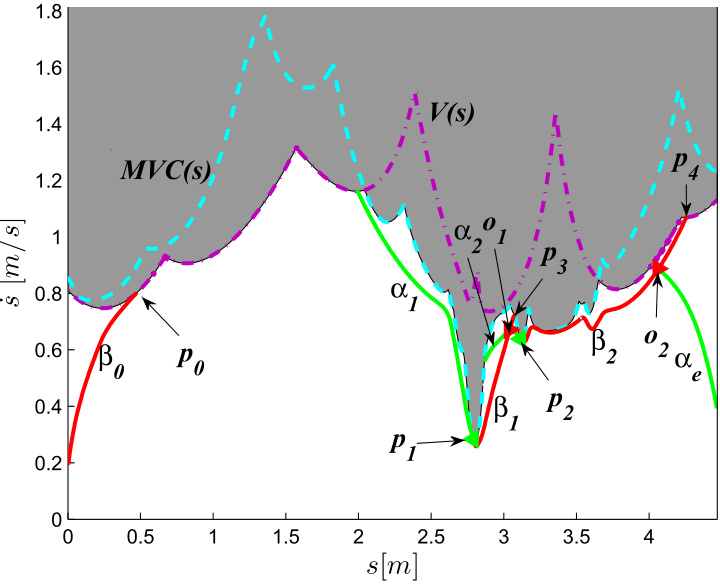  
Fig. 7. OWMR: the original NI method fails to output a feasible velocity profile with constraints    $\omega_{\mathrm{max}}$   and    $\mathbf{\mathbf{\mathbf{\mathbf{\mathbf{\mathbf{\mathbf{\mathbf{\mathbf{\mathbf{\mathbf{\mathbf{\mathbf{\mathbf{\mathbf{\mathbf{\mathbf{\mathbf{\mathbf{\mathbf{\mathbf{\mathbf{\mathbf{\mathbf{\mathbf{\mathbf{\mathbf{\mathbf{\mathbf{\mathbf{\mathbf{\mathbf{\mathbf{\mathbf{\mathbf{\mathbf{\mathbf{\mathbf{\mathbf{\mathbf{\mathbf{\mathbf{\mathbf{\mathbf{\mathbf{\mathbf{\mathbf{\mathbf{\mathbf{\mathbf{\mathbf{\mathbf{\mathbf{\mathbf{\mathbf{\mathbf{\mathbf{\mathbf{\mathbf{\mathbf{\mathbf{\mathbf{\mathbf{\mathbf{\mathbf{\mathbf{\mathbf{\mathbf{\mathbf{\mathbf{\mathbf{\mathbf{\mathbf{\mathbf{\mathbf{\mathbf{\mathbf{\mathbf{\mathbf{\mathbf{\mathbf{\mathbf{\mathbf{\mathbf{\mathbf{\}}}}}}}}}}}}}}}}}}}}}}}}}}}}}}}}}}}}}}}}}}}}}}}}}}}}}}}}}}}}}}}}}}}}}}}}}}}}$  .  

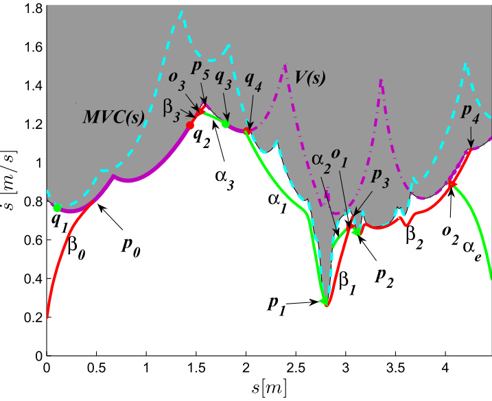  
Fig. 8. OWMR: the proposed approach outputs a time-optimal velocity profile with constraints    $\omega_{\mathrm{max}}$   and    $\mathbf{\mathbf{\mathbf{\mathbf{\mathbf{\mathbf{\mathbf{\mathbf{\mathbf{\mathbf{\mathbf{\mathbf{\mathbf{\mathbf{\mathbf{\mathbf{\mathbf{\mathbf{\mathbf{\mathbf{\mathbf{\mathbf{\mathbf{\mathbf{\mathbf{\mathbf{\mathbf{\mathbf{\mathbf{\mathbf{\mathbf{\mathbf{\mathbf{\mathbf{\mathbf{\mathbf{\mathbf{\mathbf{\mathbf{\mathbf{\mathbf{\mathbf{\mathbf{\mathbf{\mathbf{\mathbf{\mathbf{\mathbf{\mathbf{\mathbf{\mathbf{\mathbf{\mathbf{\mathbf{\mathbf{\mathbf{\mathbf{\mathbf{\mathbf{\mathbf{\mathbf{\mathbf{\mathbf{\mathbf{\mathbf{\mathbf{\mathbf{\mathbf{\mathbf{\mathbf{\mathbf{\mathbf{\mathbf{\mathbf{\mathbf{\mathbf{\mathbf{\mathbf{\mathbf{\mathbf{\mathbf{\mathbf{\mathbf{\mathbf{\mathbf{\}}}}}}}}}}}}}}}}}}}}}}}}}}}}}}}}}}}}}}}}}}}}}}}}}}}}}}}}}}}}}}}}}}}}}}}}}}}}$  .  

In  Fig. 7 , when the accelerating curve    $\beta_{0}$   hits   $\mathbf{M}\mathbf{V}\mathbf{C}^{*}$  at    $p_{0}$  it cannot intersect either the decelerating curve    $\alpha_{1}$   from the switch point  $p_{1}$  , the decelerating curve  $\alpha_{2}$   from the switch point  $p_{2}$  , or the decelerating curve    $\alpha_{e}$   from the point   $(s=s_{e}\,,\dot{s}=\dot{s}_{e})$  ). Therefore, the original NI fails to output a feasible velocity profile.  

The time cost of the proposed CTOA-TV is   $35~\mathrm{ms}$  , which shows good real-time performance. With the aid of switch arcs (purple solid curves:  $\widehat{q_{1}q_{2}}$   and  $\widehat{q_{3}q_{4}}$   in  Fig. 8 ), the proposed approach generates a time-optimal velocity profile along the specified path under both velocity and acceleration constraints. When the accelerating curve  $\beta_{0}$   hits the switch arc  $\widehat{q_{1}q_{2}}$  , starting from  $q_{2}$  , the integrated forward accelerating curve    $\beta_{3}$   hits  $\mathbf{M}\mathbf{V}\mathbf{C}^{*}$  at  $p_{5}$  . Starting from    $p_{5}$  , the switch arc  $\widehat{q_{3}q_{4}}$   is first found along  $\mathbf{M}\mathbf{V}\mathbf{C}^{*}$  . From the point  $q_{3}$  , the integrated backward decelerating  

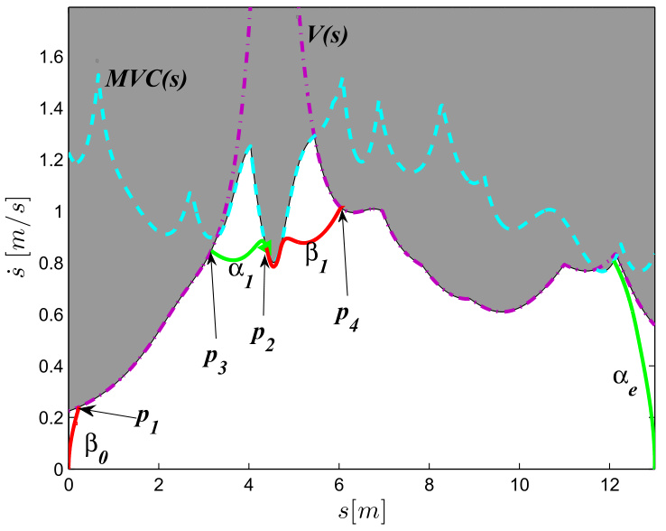  
Fig. 9. Manipulator: the original NI method fails to output a feasible velocity profile with constraints  $\dot{\pmb q}_{\mathrm{max}}$   and    $\tau_{\mathrm{max}}$  .  

curve  $\alpha_{3}$   intersects  $\beta_{3}$   at  $O_{3}$  , which verifies Property 1. Starting from    $q_{4}$  , the integrated forward accelerating curve hits   $\mathbf{M}\mathbf{V}\mathbf{C}^{*}$  at    $q_{4}$   immediately. From    $q_{4}$  , the switch point  $p_{1}$   is first found along   $\mathbf{M}\mathbf{V}\mathbf{C}^{*}$  . The integrated backward decelerating curve    $\alpha_{1}$  from  $p_{1}$   intersects  $\widehat{q_{3}q_{4}}$  . Then, the integrated forward acceler- ating curve    $\beta_{1}$   from  $p_{1}$   hits  $\mathbf{M}\mathbf{V}\mathbf{C}^{*}$  at    $p_{3}$  . Staring from    $p_{3}$  , the switch point  $p_{2}$   is first found along  $\mathbf{M}\mathbf{V}\mathbf{C}^{*}$  . Starting from    $p_{2}$  , the integrated backward decelerating curve  $\alpha_{2}$   intersects    $\beta_{1}$   at  $o_{1}$  , and the integrated forward accelerating curve  $\beta_{2}$   hits  $\mathbf{M}\mathbf{V}\mathbf{C}^{*}$  at  $p_{4}.\operatorname{Frobom}p_{4}$  , no switch point and switch arc is detected, therefore starting from the point    $\left(s=s_{e},\dot{s}=\dot{s}_{e}\right)$  ) , the decelerating curve  $\alpha_{e}$   is integrated backward and intersects    $\beta_{2}$   at  $O_{2}$  . Finally, the proposed approach generates a time-optimal velocity profile:  $\beta_{0}{-}\widehat{q_{1}q_{2}{\cdot}\beta_{3}{\cdot}\alpha_{3}{\cdot}q_{3}q_{4}{\cdot}\alpha_{1}{\cdot}\beta_{1}{\cdot}\alpha_{2}{\cdot}\beta_{2}{\cdot}\alpha_{e}}$  . These results on OWMR verify Theorem 2 and Theorem 3.  

# B. Simulation Results on Manipulator  

In this simulation, the two-link manipulator end effector moves along a fifth-order B´ ezier curve with    $n=5$   in (24) as shown in  Fig. 6 . Each element of torque constraints  $\tau_{\mathrm{max}}$   in (19) is set as  $5\,\mathrm{{Nm}}$  , and each element of velocity constraints  $\dot{\pmb q}_{\mathrm{max}}$   in (20) is set as   $30\,\mathrm{rad/s}$  . The starting and terminal path velocities equal to zero. In  Figs. 9  and  10 , cyan dash curves represent  $\mathbf{MV}\mathbf{C}(s)$   with torque constraints, and purple dash-dot curves represent    $V(s)$   with velocity constraints. According to (2), the  $\mathbf{M}\mathbf{V}\mathbf{C}^{*}$  is represented as the boundary between gray and blank regions.  

Fig. 9  shows that accelerating curves    $\beta_{0},\beta_{1}$   and decelerat- ing curves    $\alpha_{1},\alpha_{e}$   generated by the original NI do not consti- tute a feasible velocity profile under both torque and velocity constraints. However, with the aid of switch arcs (purple solid curves:  $\widehat{q_{1}q_{2}},\,\widehat{q_{3}q_{4}}$   and  $\widehat{q_{5}q_{6}}$   in  Fig. 10 ), the proposed approach generates a time-optimal velocity profile  $\beta_{0}\widehat{\cdot q_{1}q_{2}}\cdot\cdot\cdot\beta_{1}\cdot\widehat{q_{3}q_{4}}.$  -  $\beta_{2}–\widehat{q_{5}q_{6}}–\beta_{3}–\alpha_{e}$  . The corresponding computational time is   $31\,\mathrm{ms}$  . These simulation results on manipulators verify Theorem 2 and Theorem 3 of the proposed approach again.  

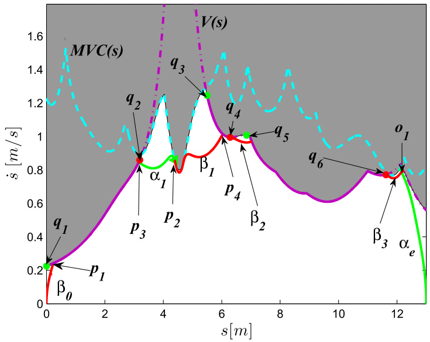  
Fig. 10. Manipulator: the proposed approach outputs a time-optimal velocity profile with constraints  $\dot{\pmb q}_{\mathrm{max}}$   and    $\tau_{\mathrm{max}}$  .  

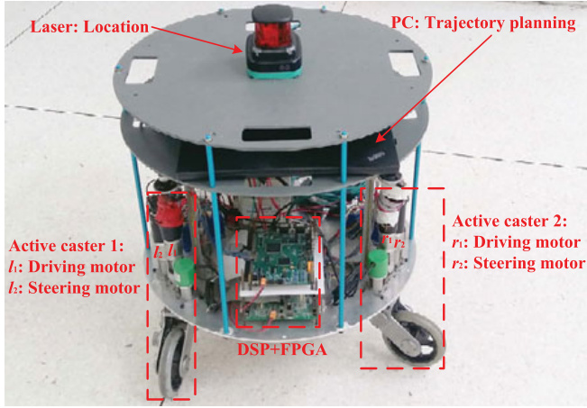  
Fig. 11. Experimental platform “NK-OMNI I” [39].  

# C. Experimental Results  

This section provides experimental results of the proposed approach on an active-caster-based OWMR “NK-OMNI I” [39] in  Fig. 11 . The robot center point  $O_{r}$   moves along a cubic B´ ezier curve (see the blue solid curve in  Fig. 12 ), and the robot orien- tation is set as  $\theta=0$  . Each element of velocity constraints    $\omega_{\mathrm{max}}$  in (12) is set as  $6\,\mathrm{rad}/\mathrm{s}$   and each element of acceleration con- straints    $\pmb{a}_{\mathrm{max}}$   in (13) is set as  $1\,\mathrm{rad}/\mathrm{s}^{2}$  . The starting and terminal path velocities equal to zero.  

The experimental results show that with the aid of switch arcs defined in Section III-A, the proposed approach generates a time-optimal velocity profile under acceleration and velocity constraints, which consists of one red accelerating curve  $\beta_{1}$  , one purple switch arc  $\widehat{q_{1}q_{2}}$  , and one green decelerating curve  $\alpha_{e}$   in Fig. 13 . It is worth mentioning that the proposed approach costs  ${39}\,\mathrm{ms}$   to output the time-optimal solution, which shows that the proposed approach can be applied in real-time planning tasks.  

With a simple proportional-integral-derivative controller, the robot tracks this time-optimal velocity profile, and the tracking errors go to zero in  Fig. 14 . The velocity and acceleration of active casters are shown in  Figs. 15  and  16 , which satisfy the  

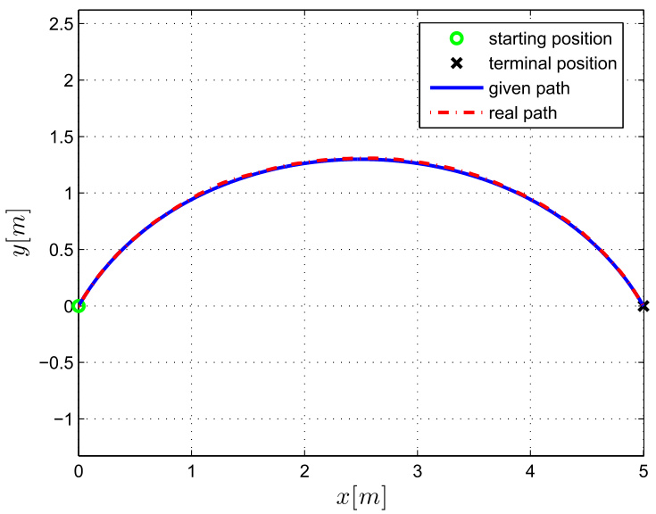  
Fig. 12. Experimental path: the blue solid line represents the given Fig. 15. Velocities of active casters: dark dash lines represent velocity path, and the red dash-dot line represents the obtained path from the constraints    $\omega_{\mathrm{max}}$   and other solid lines represent driving and steering laser positioning equipment. velocities of active casters.  

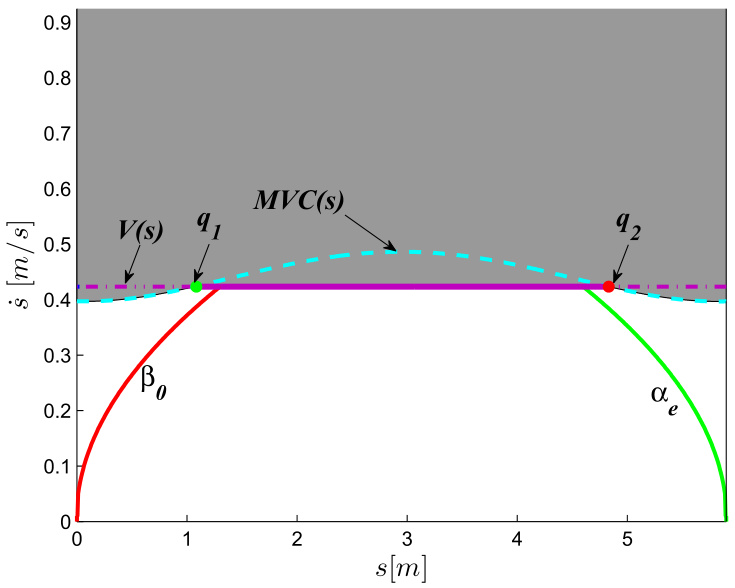  
Fig. 13. Proposed approach with constraints  $\omega_{\mathrm{max}}$   and  $\mathbf{\mathbf{\mathit{a}}_{\mathrm{max}}}$  , gener- ates a time-optimal velocity profile:  $\beta_{0}\cdot\widehat{q_{1}q_{2}}\cdot\alpha_{e}$   .  

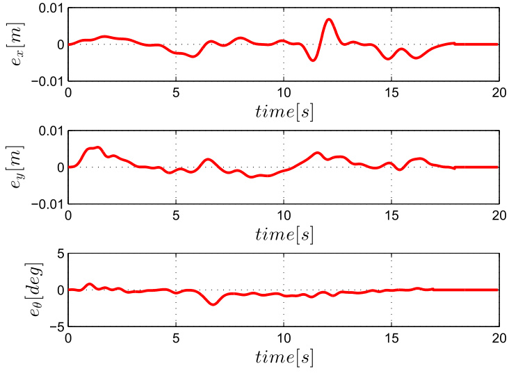  
Fig. 14. Tracking errors for  $x,y$  ,  and  $\theta$  .  

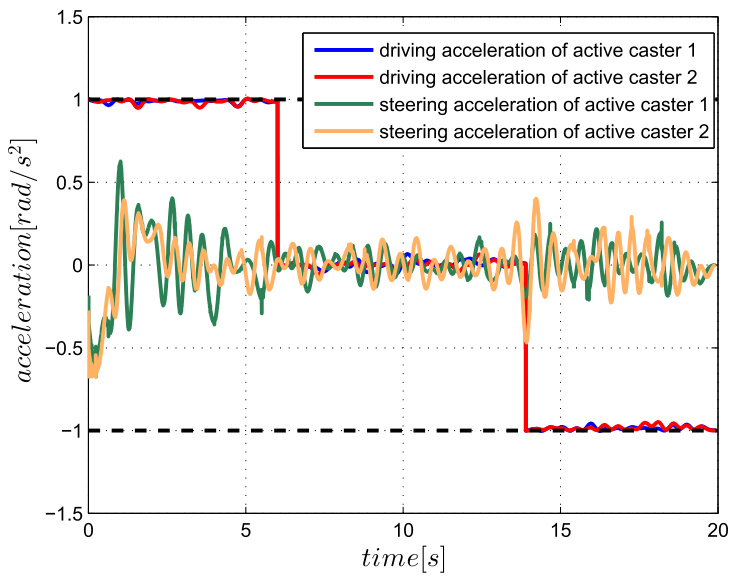  
Fig. 16. Accelerations of active casters: dark dash lines represent ac- celeration constraints    $\mathbf{\pmb{a}}_{\mathsf{m a x}}$   and other solid lines represent driving and steering accelerations of active casters.  

corresponding constraints. When the robot tracks the accelerat- ing curve    $\beta_{0}$  , the driving accelerations of active casters equal to   $1\,\mathrm{rad}/\mathrm{s}^{2}$  . When the robot tracks  $\widehat{q_{1}q_{2}}$  , the driving velocities of active casters are limited by   $6\,\mathrm{rad}/\mathrm{s}$  , and the corresponding driving accelerations are close to zero. When the robot tracks the decelerating curve    $\alpha_{e}$  , the driving accelerations of active casters equal to    $-1\,\mathrm{rad}/\mathrm{s}^{2}$  . From the above-mentioned analysis, some active casters touch either velocity bounds or acceleration bounds, thus the robot achieves time-optimal trajectory planning while satisfying both acceleration and velocity constraints.  

# VII. C ONCLUSION  

We have proposed a complete, time-optimal and real-time algorithm for path-constrained trajectory planning under both torque and velocity constraints. The contribution is both theoretically and practically important. Theoretically, with rig- orous mathematical proofs, we show the completeness and time optimality of the presented algorithm, which guarantee safe and efficient motion of robotic systems in the presence of both torque and velocity constraints. Practically, the presented al- gorithm is general and it is implemented on different robotic systems to obtain time-optimal trajectories in real time. Compar- ative simulation and experimental results on manipulators and OWMRs demonstrate the superior performance of the presented algorithm.  

# R EFERENCES  

[1] C. Lin, P. Chang, and J. Luh, “Formulation and optimization of cubic polynomial joint trajectories for industrial robots,”  IEEE Trans. Automat. Control , vol. AC-28, no. 12, pp. 1066–1074, Dec. 1983.

 [2] O. Stryk and R. Bulirsch, “Direct and indirect methods for trajectory optimization,”  Ann. Oper. Res. , vol. 37, no. 1, pp. 357–373, 1992.

 [3] M. Steinbach, H. Bock, and R. Longman, “Time optimal exten- sion and retraction of robots: Numerical analysis of the switching structure,”  J. Optim. Theory Appl. , vol. 84, no. 3, pp. 589–616, 1995.

 [4] K. Kim and B. Kim, “Minimum-time trajectory for three-wheeled om- nidirectional mobile robots following a bounded-curvature path with a referenced heading profile,”  IEEE Trans. Robot. , vol. 27, no. 4, pp. 800–808, Aug. 2011.

 [5] E. Barnett and C. Gosselin, “Time-optimal trajectory planning of cable- driven parallel mechanisms for fully-specified paths with G1 discon- tinuities,”  J. Dyn. Syst. Meas. Control , vol. 137, no. 7, pp. 603–617, 2015.

 [6] K. Kant and S. Zucker, “Toward efficient trajectory planning: The velocity decomposition,”  Int. J. Robot. Res. , vol. 5, no. 3, pp. 72–89, 1986.

 [7] K. Hauser, “Fast interpolation and time-optimization with contact,”  Int. J. Robot. Res. , vol. 33, no. 9, pp. 1231–1250, 2014.

 [8] C. Bianco and F. Ghilardelli, “Real-time planner in the operational space for the automatic handling of kinematic constraints,”  IEEE Trans. Autom. Sci. Eng. , vol. 11, no. 3, pp. 730–739, Jul. 2014.

 [9] T. Kunz and M. Stilman, “Time-optimal trajectory generation for path following with bounded acceleration and velocity,” in  Proc. Robot., Sci. Syst. , pp. 9–13, 2012.

 [10] L.  Zlajpah, “On time optimal path control of manipulators with bounded joint velocities and torques,” in  Proc. IEEE Int. Conf. Robot. Autom. , 1996, pp. 1572–1577.

 [11] F. Lamiraux and J. Laumond, “From paths to trajectories for multi- body mobile robots,” in  Proc. 5th Int. Symp. Exp. Robot. , 1998, pp. 301–309.

 [12] P. Shen, X. Zhang, and Y. Fang, “Essential properties of numerical inte- gration for time-optimal trajectory planning along a specified path,”  IEEE Robot. Autom. Lett. , vol. 2, no. 2, pp. 888–895, Apr. 2017.

 [13] S. Macfarlane and E. Croft, “Jerk-bounded manipulator trajectory plan- ning: Design for real-time applications,”  IEEE Trans. Robot. Autom. , vol. 19, no. 1, pp. 42–52, Feb. 2003.

 [14] K. Shin and N. McKay, “A dynamic programming approach to trajectory planning of robotic manipulators,”  IEEE Trans. Automat. Control , vol. 31, no. 6, pp. 491–500, Jun. 1986.

 [15] S. Behzadipour and A. Khajepour, “Time-optimal trajectory planning in cable-based manipulators,”  IEEE Trans. Robot. , vol. 22, no. 3, pp. 559– 563, Jun. 2006.

 [16] D. Verscheure, B. Demeulenaere, J. Swevers, J. Schutter, and M. Diehl, “Time-optimal path tracking for robots: A convex optimization ap- proach,”  IEEE Trans. Automat. Control , vol. 54, no. 10, pp. 2318–2327, Oct. 2009.

 [17] D. Constantinescu and E. Croft, “Smooth and time-optimal trajectory planning for industrial manipulators along specified paths,”  J. Robot. Syst. , vol. 17, no. 5, pp. 233–249, 2000.

 [18] K. Shin and N. Mckay, “Minimum-time control of robotic manipulators with geometric path constraints,”  IEEE Trans. Automatic Control , vol. AC- 30, no. 6, pp. 531–541, Jun. 1985.

 [19] J. Bobrow, S. Dubowsky, and J. Gibson, “Time-optimal control of robotic manipulators along specified paths,”  Int. J. Robot. Res. , vol. 4, no. 3, pp. 3–17, 1985.  

[20] J. Slotine and H. Yang, “Improving the efficiency of time-optimal path- following algorithms,”  IEEE Trans. Robot. Autom. , vol. 5, no. 1, pp. 118– 124, Feb. 1989.

 [21] F.Pfeiffer and R.Johanni,“Aconcept for manipulator trajectory planning,” IEEE J. Robot. Autom. , vol. 3, no. 2, pp. 115–123, Apr. 1987.

 [22] Q. Pham, “A general, fast, and robust implementation of the time-optimal path parameter iz ation algorithm,”  IEEE Trans. Robot. , vol. 30, no. 6, pp. 1533–1540, 2014.

 [23] K. Shin and N. McKay, “Selection of near-minimum time geometric paths for robotic manipulators,”  IEEE Trans. Automat. Control , vol. AC-31, no. 6, pp. 501–511, Jun. 1986.

 [24] S. Singh and M. Leu, “Optimal trajectory generation for robotic manipula- tors using dynamic programming,”  J. Dyn. Syst. Meas. Control , vol. 109, no. 2, pp. 88–96, 1987.

 [25] F. Debrouwere  et al. , “Time-optimal path following for robots with convex-concave constraints using sequential convex programming,”  IEEE Trans. Robot. , vol. 29, no. 6, pp. 1485–1495, Dec. 2013.

 [26] A. Singh and K. Krishna, “A class of non-linear time scaling functions for smooth time optimal control along specified paths,” in Proc. 2015 IEEE/RSJ Int. Conf. Intell. Robots Syst. , 2015, pp. 5809–5816.

[27] D. Hujic, E. Croft, G. Zak, R. Fenton, J. Mills, and B. Benhabib, “The robotic interception of moving objects in industrial settings: Strategy de- velopment and experiment,”  IEEE/ASME Trans. Mechatronics , vol. 3, no. 3, pp. 225–239, Sep. 1998.

 [28] A. Matsushita and T. Tsuchiya, “Control system design with on-line planning for a desired signal and its application to robot manipula- tors,”  IEEE/ASME Trans. Mechatronics , vol. 3, no. 2, pp. 149–152, Jun. 1998.

 [29] M.Yuan,Z.Chen,B.Yao,and X.Zhu,“Time optimal contouring controlof industrial biaxial gantry: A highly efficient analytical solution of trajectory planning,”  IEEE/ASME Trans. Mechatronics , vol. 22, no. 1, pp. 247–257, Feb. 2017.

 [30] Z. Chen, B. Yao, and Q. Wang, “  $\mu$  -synthesis-based adaptive robust con- trol of linear motor driven stages with high-frequency dynamics: A case study,”  IEEE/ASME Trans. Mechatronics , vol. 20, no. 3, pp. 1482–1490, Jun. 2015.

 [31] Z. Chen, B. Yao, and Q. Wang, “Accurate motion control of linear mo- tors with adaptive robust compensation of nonlinear electromagnetic field effect,”  IEEE/ASME Trans. Mechatronics , vol. 18, no. 3, pp. 1122–1129, Jun. 2013.

 [32] Z. Shiller, “On singular time-optimal control along specified paths,”  IEEE Trans. Robot. Autom. , vol. 10, no. 4, pp. 561–566, Aug. 1994.

 [33] H. Nguyen and Q. Pham, “Time-optimal path parameter iz ation of rigid- body motions: Applications to spacecraft reorientation,”  J. Guid. Control Dyn. , vol. 39, no. 7, pp. 1667–1671, 2016.

 [34] Q. Pham and O. Stasse, “Time-optimal path parameter iz ation for redun- dantly actuated robots: A numerical integration approach,”  IEEE/ASME Trans. Mechatronics , vol. 20, no. 6, pp. 3257–3263, 2015.

 [35] K. Goldberg, “Completeness in robot motion planning,” in  Proc. Workshop Algorithmic Found. Robot. , San Francisco, CA, USA, pp. 419–429, 1994.

 [36] M. Dogar, A. Spielberg, S. Baker, and D. Rus, “Multi-robot grasp planning for sequential assembly operations,” in  Proc. 2015 IEEE Int. Conf. Robot. Autom. , 2015, pp. 193–200.

 [37] E. Masehian and M. Amin-Naseri, “Mobile robot online motion planning using generalized Voronoi graphs,”  J. Ind. Eng. , vol. 4, no. 5, pp. 1–15, 2010.

 [38] Q. Pham, S. Caron, P. Lertkultanon, and Y. Nakamura, “Admissible veloc- ity propagation: Beyond quasi-static path planning for high-dimensional robots,”  Int. J. Robot. Res. , vol. 36, no. 1, pp. 44–67, 2017.

 [39] P. Shen, Y. Fang, and X. Zhang, “Trajectory planning of omnidirectional mobile robots with active casters: Multi-motor coordination and singu- larity avoidance,” in  Proc. 2015 IEEE Int. Conf. Cyber Technol. Autom., Control Intell. Syst. , 2015, pp. 151–156.

 [40] G. Campion, G. Bastin, and B. D’Andr´ ea-Novel, “Structural properties and classification of kinematic and dynamic models of wheeled mo- bile robots,”  IEEE Trans. Robot. Autom. , vol. 12, no. 1, pp. 47–62, Feb. 1996.

 [41] Y. Chen, Y. Cai, J. Zheng, and D. Thalmann, “Accurate and ef- ficient approximation of clothoids using B´ ezier curves for path planning,”  IEEE Trans. Robot. , vol. 33, no. 5, pp. 1242–1247, Oct. 2017.

 [42] K. Yang and S. Sukkarieh, “An analytical continuous-curvature path- smoothing algorithm,”  IEEE Trans. Robot. , vol. 26, no. 3, pp. 561–568, Jun. 2010.  

  

  

Peiyao Shen  received the B.S. degree in in- telligence science and technology from Xidian University, Xi’an, China, in 2014. He is currently working toward the Ph.D. degree at the Institute of Robotics and Automatic Information Systems, Nankai University, Tianjin, China. His research interests include motion planning of omnidirec- tional wheeled mobile robots.  

Xuebo Zhang  (M’12) received the B.Eng. de- gree in automation from Tianjin University, Tianjin, China, in 2002, and the Ph.D. degree in control theory and control engineering from Nankai University, Nankai, China, in 2011.  

He is currently an Associate Professor with the Institute of Robotics and Automatic Informa- tion Systems and also the Tianjin Key Laboratory of Intelligent Robotics, Nankai University. His re- search interests include mobile robotics, motion planning, and visual servoing.  

Yongchun Fang  (S’00–M’02–SM’08) received the B.S. and M.S. degrees in control the- ory and applications from Zhejiang University, Hangzhou, China, in 1996 and 1999, respec- tively, and the Ph.D. degree in electrical engi- neering from Clemson University, Clemson, SC, USA, in 2002.  

  

From 2002 to 2003, he was a Postdoctoral Fellow with the Sibley School of Mechanical and Aerospace Engineering, Cornell University, Ithaca, NY, USA. He is currently a Professor with  

the Institute of Robotics and Automatic Information Systems, Nankai University, Tianjin, China. His research interests include nonlinear con- trol, visual servoing, control of underactuated systems, and AFM-based nano-systems.  

Dr. Fang is an Associate Editor of the  ASME Journal of Dynamic Systems, Measurement, and Control  and  Journal of Control Theory and Applications .  