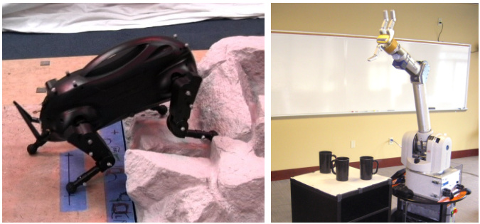
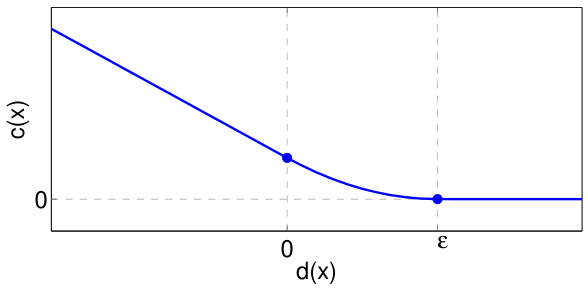
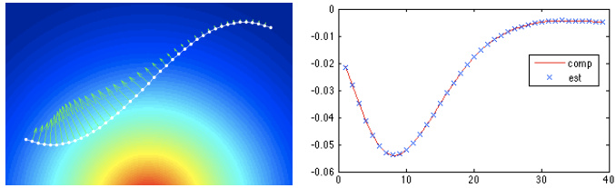
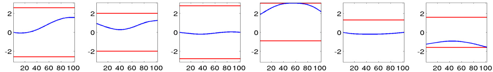
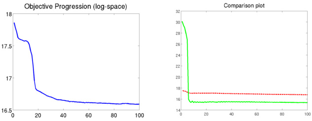
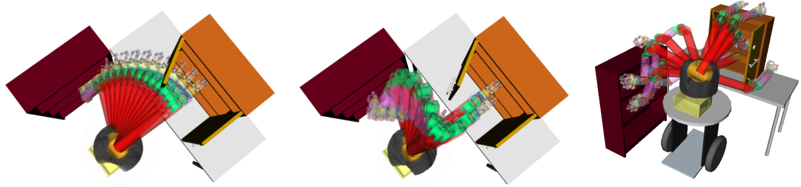
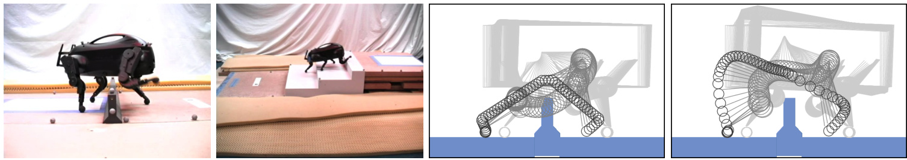

# CHOMP: Gradient Optimization Techniques for Efficient Motion Planning  

Nathan Ratliff 1 Matt Zucker 1 J. Andrew Bagnell 1 Siddhartha Srinivasa 2  

1 The Robotics Institute 2 Intel Research Carnegie Mellon University Pittsburgh, PA { ndr, mzucker, dbagnell } @cs.cmu.edu siddhartha.srinivasa@intel.com  

Abstract — Existing high-dimensional motion planning algo- rithms are simultaneously overpowered and underpowered. In domains sparsely populated by obstacles, the heuristics used by sampling-based planners to navigate “narrow passages” can be needlessly complex; furthermore, additional post-processing is required to remove the jerky or extraneous motions from the paths that such planners generate. In this paper, we present CHOMP, a novel method for continuous path refinement that uses covariant gradient techniques to improve the quality of sampled trajectories. Our optimization technique converges over a wider range of input paths and is able to optimize higher- order dynamics of trajectories than previous path optimization strategies. As a result, CHOMP can be used as a standalone motion planner in many real-world planning queries. The effectiveness of our proposed method is demonstrated in ma- nipulation planning for a 6-DOF robotic arm as well as in trajectory generation for a walking quadruped robot.  

# I. I NTRODUCTION  

In recent years, sampling-based planning algorithms have met with widespread success due to their ability to rapidly discover the connectivity of high-dimensional configura- tion spaces. Planners such as the Probabilistic Roadmap (PRM) and Rapidly-exploring Random Tree (RRT) algo- rithms, along with their descendents, are now used in a multitude of robotic applications [15], [16]. Both algorithms are typically deployed as part of a two-phase process: first find a feasible path, and then optimize it to remove redundant or jerky motion.  

Perhaps the most prevalent method of path optimization is the so-called “shortcut” heuristic, which picks pairs of configurations along the path and invokes a local planner to attempt to replace the intervening sub-path with a shorter one [14], [5]. “Partial shortcuts” as well as medial axis retraction have also proven effective [11]. Another approach used in elastic bands or elastic strips planning involves modeling paths as mass-spring systems: a path is assigned an internal energy related to its length or smoothness, along with an external energy generated by obstacles or task- based potentials. Gradient based methods are used to find a minimum-energy path [20], [4].  

In this paper we present Covariant Hamiltonian Optimiza- tion and Motion Planning (CHOMP), a novel method for generating and optimizing trajectories for robotic systems. The approach shares much in common with elastic bands planning; however, unlike many previous path optimization techniques, we drop the requirement that the input path be collision free. As a result, CHOMP can often transform a  

  
Fig. 1. Experimental robotic platforms: Boston Dynamic’s LittleDog (left), and Barrett Technologys’s WAM arm (right).  

na¨ ıve initial guess into a trajectory suitable for execution on a robotic platform without invoking a separate motion plan- ner. A covariant gradient update rule ensures that CHOMP quickly converges to a locally optimal trajectory.  

In many respects, CHOMP is related to optimal control of robotic systems. Instead of merely finding feasible paths, our goal is to directly construct trajectories which optimize over a variety of dynamic and task-based criteria. Few current approaches to optimal control are equipped to handle obsta- cle avoidance, though. Of those that do, many approaches require some description of configuration space obstacles, which can be prohibitive to create for high-dimensional manipulators [25]. Many optimal controllers which do handle obstacles are framed in terms of mixed integer programming, which is known to be an NP-hard problem [24], [9], [17], [27]. Approximate optimal algorithms exist, but so far, only consider very simple obstacle representations [26].  

In the rest of this document, we give a detailed derivation of the CHOMP algorithm, show experimental results on a 6-DOF robot arm, detail the application of CHOMP to quadruped robot locomotion, and outline future directions of work. The accompanying video in the conference proceed- ings also contains examples of running CHOMP on both robot platforms.  

# II. T HE  CHOMP A LGORITHM  

In this section, we present CHOMP, a new trajectory opti- mization procedure based on covariant gradient descent. An important theme throughout this exposition is the proper use of geometrical relations, particularly as they apply to inner products. This is a particularly important idea in differential geometry [8]. These considerations appear in three primary locations within our technique. First, we find that in order to encourage smoothness we need measure the size of an update to our hypothesis in terms of the amount of dynamical quantity (such as total velocity or total acceleration) it adds to the trajectory. Second, measurements of obstacle costs should be taken in the workspace so as to correctly account for the geometrical relationship between the robot and the surrounding environment. And finally, the same geometrical considerations used to update a trajectory should be used when correcting any joint limit violations that may occur. Sections II-A, II-D, and II-F detail each of these points in turn.  

# A. Covariant Gradient Descent  

Formally, our goal is to find a smooth, collision-free, trajectory through the configuration space    $\mathbb{R}^{m}$    between two prespecified end points  $q_{\mathrm{init}}$ ,  $q_{\mathrm{total}}\,\in\,\mathbb{R}^{m}$ . In prdiscretize our trajectory into a set of  n  waypoints  $q_{1},\ldots,q_{n}$  (excluding the end points) and compute dynamical quan- tities via finite differencing. We focus presently on finite- dimensional optimization, although we will return to the continuous trajectory setting in section II-D. Section II-E, discusses the relationship between these settings.  

We model the cost of a trajectory using two terms: an obstacle term    $f_{o b s}$  , which measures the cost of being near obstacles; and a prior term    $f_{p r i o r}$  , which measures dynamical quantities of the robot such as smoothness and acceleration. We generally assume that    $f_{p r i o r}$   is independent of the environment. Our objective can, therefore, be written  

$$
\mathcal{U}(\xi)=f_{p r i o r}(\xi)+f_{o b s}(\xi).
$$  

More precisely, the prior term is a sum of squared derivatives. Given suitable finite differencing matrices    $K_{d}$   for    $d\ =$   $1,\cdot\cdot\cdot,D$  , we can represent the function as a sum of terms  

$$
f_{p r i o r}(\xi)=\frac{1}{2}\sum_{d=1}^{D}w_{d}\left|\left|K_{d}\,\xi+e_{d}\right|\right|^{2},
$$  

where    $e_{d}$   are constant vectors that encapsulate the contri- butions from the fixed end points. For instance, the first term   $(d=1)$  ) represents the total squared velocity along the trajectory. In this case, we can write    $K_{1}$   and    $e_{1}$   as  

$$
\begin{array}{r l}&{K_{1}=\left[\begin{array}{c c c c c c}{1}&{0}&{0}&{\ldots}&{0}&{0}\\ {-1}&{1}&{0}&{\ldots}&{0}&{0}\\ {0}&{-1}&{1}&{\ldots}&{0}&{0}\\ {\vdots}&{\vdots}&{\ddots}&&{\vdots}\\ {0}&{0}&{0}&{\ldots}&{-1}&{1}\\ {0}&{0}&{0}&{\ldots}&{0}&{-1}\end{array}\right]\otimes I_{m\times m}}\\ &{e_{1}=\left[-q_{0}^{T},0,\ldots,0,q_{n+1}^{T}\right]^{T}.}\end{array}
$$  

where    $\otimes$  denotes the Kronecker (tensor) product. We note that    $f_{p r i o r}$   is a simple quadratic form:  

$$
f_{p r i o r}(\boldsymbol{\xi})=\frac{1}{2}\boldsymbol{\xi}^{T}\boldsymbol{A}\,\boldsymbol{\xi}+\boldsymbol{\xi}^{T}\boldsymbol{b}+\boldsymbol{c}
$$  

for suitable matrix, vector, and scalar constants    $A,b,c$  . We note that    $A$   is symmetric positive definite for all    $d$  .  

We seek to improve the trajectory by iteratively mini- mizing a local approximation of the function using only smooth updates, where we define smoothness as measured by equation 1. At iteration    $k$  , within a region of our current hypothesis    $\xi_{k}$  , we can approximate our objective using a first-order Taylor expansion:  

$$
\boldsymbol{\mathcal{U}}(\xi)\approx\boldsymbol{\mathcal{U}}(\xi_{k})+\boldsymbol{g}_{k}^{T}\big(\xi-\xi_{k}\big),
$$  

where    $g_{k}=\nabla\mathcal{U}(\xi_{k})$  . Our update can be written formally as  

$$
\xi_{k+1}=\underset{\xi}{\arg\operatorname*{min}}\left\{\mathcal{U}(\xi_{k})+g_{k}^{T}\big(\xi-\xi_{k}\big)+\frac{\lambda}{2}\|\xi-\xi_{k}\|_{M}^{2}\right\},
$$  

where the notation    $\|\delta\|_{M}^{2}$    denotes the norm of the displace- nt    $\delta=\xi\!-\!\xi_{k}$  en with respect to the Riemannian metric  $M$   equal to  δ  $\delta^{T}M\,\delta$  . Setting the gradient of the right hand side of equation 3 to zero and solving results in the following more succinct rule:  

$$
\xi_{k+1}=\xi_{k}-\frac1\lambda M^{-1}g_{k}
$$  

It is well known in optimization theory that solving a regu- larized problem of the form given in equation 3 is equivalent to minimizing the linear approximation in equation 2 within a ball around  $\xi_{k}$   whose radius is related to the regularization constant  $\lambda$   [3]. Since under the metric    $A$  , the norm of non- smooth trajectories is large, this ball contains only smooth updates    $\delta\ =\ \xi\,-\,\xi_{k}$  , Our update rule, therefore, serves to ensure that the trajectory remains smooth after each trajectory modification.  

# B. Understanding the Update Rule  

This update rule is a special case of a more general rule known as Covariant gradient descent [2], [29], in which the matrix    $A$   need not be constant.   In our case, it is useful to interpret the action of the inverse operator    $A^{-1}$    as spreading the gradient across the entire trajectory. As an example, we take    $d=1$   and note that  $A$   is a finite differencing operator for approximating accelerations. Since    $A A^{-1}=I$  , we see that the  i th column/row of    $A^{-1}$    has zero acceleration everywhere, except at the  i th entry.    $A^{-1}g_{k}$   can, therefore, be viewed as a vector of projections of    $g_{k}$   onto the set of smooth basis vectors forming  $A^{-1}$  .  

CHOMP is  covariant  in the sense that the change to the trajectory that results from the update is a function only of the trajectory itself, and not the particular representation used (e.g. waypoint based)– at least in the limit of small step size and fine discretization. This normative approach makes it easy to derive the CHOMP update rule: we can understand equation 3 as the Langrangian form of an optimization problem [1] that attempts to maximize the decrease in our objective function subject to making only a small change in the average acceleration of the resulting trajectory– not simply making a small change in the parameters that define the trajectory in a particular representation.  

We gain additional insight into the computational benefits of the covariant gradient based update by considering the analysis tools developed in the online learning/optimization literature and especially [28], [12]. Analyzing the behavior of the CHOMP update rule in the general case is very difficult to characterize. However, by considering in a region around a local optima sufficiently small that    $f_{o b s}$   is convex we can gain insight into the performance of both standard gradient methods (including those considered by, e.g. [20]) and the CHOMP rule.  

We first note that under these conditions, the overall CHOMP objective function is  strongly convex  [22]– that is, it can be lower-bounded over the entire region by a quadratic with curvature  $A$  . [12] shows how gradient-style updates can be understood as sequentially minimizing a local quadratic approximation to the objective function. Gradient descent minimizes an uninformed, isotropic quadratic approximation while more sophisticated methods, like Newton steps, com- pute tighter lower bounds using a Hessian. In the case of CHOMP, the Hessian need not exist as our objective function may not even be differentiable, however we may still form a quadratic lower bound using    $A$  . This is much tighter than an isotropic bound and leads to a correspondingly faster minimization of our objective– in particular, in accordance with the intuition of adjusting large parts of the trajectory due to the impact at a single point we would generally expect it to be    $O(n)$   times faster to converge than a standard, Euclidean gradient based method that adjusts a single point due an obstacle.  

Importantly, we note that we are not simulating a mass- spring system as in [20]. We instead formulate the problem as covariant optimization in which we optimize directly within the space of trajectories. In [19], a similar optimization setting is discussed, although, more traditional Euclidean gradients are derived. We demonstrate below that optimizing with respect to our smoothness norm substantially improves convergence.  

In our experiments, we additionally implemented a version of this algorithm based on Hamiltonian Monte Carlo [18], [29]. This variant is a Monte Carlo sampling technique that utilizes gradient information and energy conservation concepts to efficiently navigate equiprobability curves of an augmented state-space. It can essentially be viewed as a well formulated method of adding noise to the system; importantly, the algorithm is guaranteed to converge to a stationary distribution inversely proportional to the exponen- tiated objective function.  

Hamiltonian Monte Carlo provides a first step toward a complete motion planner built atop these concepts. However, as we discuss in section V, while the algorithm solves a substantially larger breadth of planning problems than traditional trajectory optimization algorithms, it still falls prey to local minima for some more difficult problems when constrained by practical time limitations.  

  
Fig. 2. Potential function for obstacle avoidance  

# C. Obstacles and Distance Fields  

Let  $\mathcal{B}$   denote the set of points comprising the robot body. When the robot is in configuration    $q$  , the workspace location of the element    $u\in\mathcal B$   is given by the function  

$$
\boldsymbol{x}(\boldsymbol{q},\boldsymbol{u}):\mathbb{R}^{m}\times\mathcal{B}\mapsto\mathbb{R}^{3}
$$  

A trajectory for the robot is then collision-free if for every configuration    $q$   along the trajectory and for all    $u\in{\mathcal{B}}$  , the distance from    $x(q,u)$   to the nearest obstacle is greater than  $\varepsilon\geq0$  .  

If obstacles are static and the description of    $\mathcal{B}$   is geometri- cally simple, it becomes advantageous to simply precompute a signed distance field    $d(x)$   which stores the distance from a point  $x\in\mathbb{R}^{3}$    to the boundary of the nearest obstacle. Values of    $d(x)$   are negative inside obstacles, positive outside, and zero at the boundary.  

Computing    $d(x)$   on a uniform grid is straightforward. We start with a boolean-valued voxel representation of the environment, and compute the Euclidean Distance Transform (EDT) for both the voxel map and its logical complement. The signed distance field is then simply given by the difference of the two EDT values. Computing the EDT is surprisingly efficient: for a lattice of    $K$   samples, computation takes time    $O(K)$   [10].  

When applying CHOMP, we typically use a simplified geometric description of our robots, approximating the robot as a “skeleton” of spheres and capsules, or line-segment swept spheres. For a sphere of radius    $r$   with center    $x$  , the distance from any point in the sphere to the nearest obstacle is no less than    $d(x)-r$  . An analogous lower bound holds for capsules.  

There are a few key advantages of using the signed distance field to check for collisions. Collision checking is very fast, taking time proportional to the number of voxels occupied by the robot’s “skeleton”. Since the signed distance field is stored over the workspace, computing its gradient via finite differencing is a trivial operation. Finally, because we have distance information everywhere, not just outside of obstacles, we can generate a valid gradient even when the robot is in collision – a particularly difficult feat for other representations and distance query methods.  

Now we can define the workspace potential function    $c(x)$  , which penalizes points of the robot for being near obstacles. The simplest such function might simply be  

$$
c(x)=\operatorname*{max}\left(\varepsilon-d(x),0\right)
$$  

A smoother version, shown in figure 2, is given by  

$$
c(x)=\left\{\begin{array}{c l}{-d(x)+\frac{1}{2}\,\varepsilon,\quad}&{\mathrm{if~}d(x)<0}\\ {\frac{1}{2\,\varepsilon}\,(d(x)-\varepsilon)^{2},\quad}&{\mathrm{if~}0\leq d(x)\leq\varepsilon}\\ {0,\quad}&{\mathrm{otherwise}}\end{array}\right.
$$  

# D. Defining an obstacle potential  

We will switch for a moment to discussing optimization of a continuous trajectory    $q(t)$   by defining our obstacle potential as a functional over    $q$  . As we show in the next section, we could also derive the objective over a prespecified discretization, but we find that the properties of the objective function more clearly present themselves in the functional setting.  

To begin, we define a workspace pote  $c:\mathbb{R}^{3}\to\mathbb{R}$  that quantifies the cost of a b y element  $u\in\mathcal B$   ∈B  of the robot residing at a particular point  x  in the workspace.  

Intuitively, we would like to integrate these cost values across the entire robot. A straightforward integration across time, however, is undesirable since moving more quickly through regions of high cost will be penalized less. Instead, we choose to integrate the cost elements with respect to an arc-length parameter iz ation. Such an objective will have no motivation to alter the velocity profile along the trajectory since such operations do not change the trajectory’s length. We will see that this intuition manifests itself in the func- tional gradient as a projection of workspace gradients of    $c(x)$  onto the two-dimensional plane orthogonal to the direction of motion of a body element    $u$   through the workspace.  

We therefore write our obstacle objective as  

$$
\begin{array}{l l l}{f_{o b s}[q]}&{=}&{\displaystyle\int_{0}^{1}\int_{u}\,c\Big(x\big(q(t),u\big)\Big)\left\|\frac{d}{d t}\,x\big(q(t),u\big)\right\|\,d u\,d t}\end{array}
$$  

Since    $f_{o b s}$   depends only on workspace positions and veloc- ities (and no higher order derivatives), we can derive the functional gradient as  $\begin{array}{r}{\bar{\nabla}f_{o b s}=\frac{\partial v}{\partial q}-\frac{d}{d t}\frac{\partial v}{\partial q^{\prime}}}\end{array}$     , where    $v$   denotes everything inside the time integral [7], [19]. Applying this formula to    $f_{o b s}$  , we get  

$$
\bar{\nabla}f_{o b s}=\int_{u}J^{T}\left[||x^{\prime}||\left(\left(I-\hat{x}^{\prime}\hat{x}^{\prime T}\right)\nabla c-c\kappa\right)\right]d u
$$  

where  $\kappa$   is the curvature vector [8] defined as  

$$
\kappa={\frac{1}{\|x^{\prime}\|^{2}}}\left(I-{\hat{x}}^{\prime}{\hat{x}}^{\prime T}\right)x^{\prime\prime}
$$  

and    $J$   is the kinematic Jacobian  $\textstyle{\frac{\partial}{\partial q}}x(q,u)$  . To simplify the notation we have suppressed the dependence of    $J,\,x$  , and    $c$  on integration variables  $t$   and  $u$  . We additionally denote time derivatives of    $x(q(t),u)$   using the traditional prime notation, and we denote normalized vectors by  $\hat{x}$  .  

This objective function is similar to that discussed in section 3.12 of [19]. However, there is an important dif- ference that substantially improves performance in practice. Rather than integrating with respect to arc-length through configuration space, we integrate with respect to arc-length in the workspace. This simple modification represents a fundamental change: instead of using the Euclidean geometry  

  
Fig. 3. Left: A simple two-dimensional trajectory traveling through an obstacle potential (with large potentials are in red and small potentials in blue). The gradient at each configuration of the discretization depicted as a green arrow. Right: A plot of both the continuous functional gradient given in red and the corresponding Euclidean gradient component values of the discretization at each way point in blue.  

in the configuration space, we directly utilize the geometry of the workspace.  

Intuitively, we can more clearly see the distinction by examining the functional gradients of the two formulations. Operationally, the functional gradient defined in [19] can be computed in two steps. First, we integrate across all body elements the configuration space gradient contributions that result from transforming each body element’s workspace gradient through the corresponding Jacobian. Second, we project that single summarizing vector orthogonally to the trajectory’s direction of motion in the configuration space. Alternatively, our objective performs this projection directly in the workspace before the transformation and integration steps. This ensures that orthogonality is measured with respect to the geometry of the workspace.  

In practice, to implement these updates on a discrete trajectory    $\xi$   we approximate time derivatives using finite differences wherever they appear in the objective and its functional gradient. (The Jacobian    $J$  , of course, can be computed using the straightforward Jacobian of the robot.)  

# E. Functions vs Functionals  

Although section II-A presents our algorithm in terms of a specific discretization, writing the objective in terms of functionals over continuous trajectories often enunciates its properties. Section II-D exemplifies this observation. As figure 3 demonstrates, the finite-dimensional Euclidean gradient of a discretized version of the functional  

$$
\begin{array}{r l r}{\lefteqn{f_{o b s}(\xi)=}}\\ &{}&{\sum_{t=1}^{n}\sum_{u=1}^{U}\frac{1}{2}\bigg(c\big(x_{u}(q_{t+1})\big)+c\big(x_{u}(q_{t})\big)\bigg)\cdot}\\ &{}&{\left|\left|x_{u}(q_{t+1})-x_{u}(q_{t})\right|\right|}\end{array}
$$  

converges rapidly to the functional gradient as the resolution of the discretization increases. (In this expression, we denote the forward kinematics mapping of configuration    $q$   to body element    $i$   using  $x_{u}(q)$  .) However, the gradient of any finite- dimensional discretization of the    $f_{o b s}$   takes on a substantially different form; the projection properties that are clearly identified in the functional gradient (equation 4) are no longer obvious.  

We note that the prior term can be written as a functional as well:  

$$
f_{p r i o r}[\xi]=\sum_{d=1}^{D}\int_{0}^{1}\|q^{\prime}(t)\|^{2}d t,
$$  

with functional gradient  

$$
\bar{\nabla}f_{p r i o r}[\xi]=\sum_{d=1}^{D}(-1)^{d}q^{(2d)}
$$  

In this case, a discretization of the functional gradient    $g=$   $(\bar{\nabla}f_{p r i o r}[\xi](\epsilon),.\,.\,.\,,\bar{\nabla}f_{p r i o r}[\xi](\epsilon)(1\!-\!\epsilon))^{T}$  ∇ ∇ −   exactly equals the gradient of the discretized prior when central differences are used to approximate the derivatives.  

# F. Smooth projection for joint limits and other issues  

Joint limits are traditionally handled by either adding a new potential to the objective function which penalizes the trajectory for approaching the limits, or by performing a simple projection back onto the set of feasible joint values when a violation of the limits is detected. In our experiments, we follow the latter approach. However, rather than simply resetting the violating joints back to their limit values, which can be thought of as a    $L_{1}$   projection on to the set of feasible values, we implement an approximate projection technique that projects with respect to the norm defined by the matrix  $A$   defined in section II-A.  

At each iteration, we first find the vector of updates  $v$   that would implement the    $L_{1}$   projection when added to the trajec- tory. However, before adding it, we transform that vector by the inverse of our metric    $A^{-1}$  . As discussed in section II-A, this transformation effectively smooths the vector across the entire trajectory so that the resulting update vector has small acceleration. As a result, when we add a scaled version of that vector to our trajectory  $\xi$  , we can simultaneously remove the violations while retaining smoothness.  

Our projection algorithm is listed formally below. As indicated, we may need to iterate this procedure since the smoothing operation degrades a portion of the original projection signal. However, in our experiments, all joint limit violations were corrected within a single iteration of this procedure. Figure 4 plots the final joint angle curves over time from the final optimized trajectory on a robotic arm (see section III). The fourth subplot typifies the behavior of this procedure. While    $L1$   projection often produces trajectories that threshold at the joint limit, projection with respect to the acceleration norm produces a smooth joint angle trace which only briefly brushes the joint limit as a tangent.  

# Smooth projection:  

1) Compute the update vector    $v$   used for    $L_{1}$   projection. 2) Transform the vector via our Riemannian metric    $\tilde{v}=$   $A^{-1}v$  . 3) Scale the resulting vector by    $\alpha$   such that  $\tilde{\xi}=\xi+\alpha\tilde{v}$  entirely removes the largest joint limit violation. 4) Iterate if violations remain.  

This section presents experimental results for our im- plementation of CHOMP on Barrett Technologies’s WAM arm shown in figure 1. We demonstrate the efficacy of our technique on a set of tasks typically encountered in a home manipulation setting. The arm has seven degrees of freedom, although, we planned using only the first six in these experiments.  

# A. Collision heuristic  

The home setting differs from setting such as those en- countered in legged locomotion (see section IV) in that the obstacles are often thin (e.g. they may be pieces of furniture such as tables or doors). Section II-C discusses a heuristic based on the signed distance field under which the obstacles themselves specify how the robot should best remove itself from collision. While this works well when the obstacle is a large body, such as the terrain as in the case of legged locomotion, this heuristic can fail for smaller obstacles. An initial straight-line trajectory through configuration space often contains configurations that pass entirely through an obstacle. In that case, the na¨ ıve workspace potential works tends to simultaneously push the robot out of collision on one side, but also, to pull the robot further through the obstacle on the other side.  

We avoid this behavior by adding an indicator function to the objective that makes all workspace terms that appear after the first collision along the arm (as ordered via distance to the base) vanish. This indicator factor can be written mathemat- ically as  $I(\operatorname*{min}_{j\leq i}d(x_{j}(q))$  , although implementation ally it is implemented simply by ignoring all terms after the first collision while iterating from the base of the body out toward the end effector for a given time step of the trajectory.  

Intuitively, this heuristic suggests simply that the workspace gradients encountered after then first collision of a given configuration are invalid and should therefore be ignored. Since we know the base of the robotic arm is always collision free, we are assured of a region along the arm prior to the first collision that can work to pull the rest of the arm out of collision. In our experiments, this heuristic works well to pull the trajectory free of obstacles typically encountered in the home environment.  

# B. Experimental results  

Our first experiment was designed to evaluate the efficacy of CHOMP and its probabilistic variants as a replacement for planning on a variety of everyday household manipulation problems. We chose  15  different configurations in a given scene representing various tasks such as picking up an object from the table, placing an object on a shelf, or pulling an item from a cupboard. Using these start/goal points we generated 105  planning problem consisting of planning between all pairs of end configurations. Figure 6 shows the  15  end configurations (right) and compares the initial trajectory (left)  

  
Fig. 4. Left: This figure shows the joint angle traces that result from running CHOMP on the robot arm described in section III using the smooth projection procedure discussed in section II-F. Each subplot shows a different joint’s trace across the trajectory in blue with upper and lower joint limits denoted in red. The fourth subplot typifies the behavior of projection procedure. The trajectory retains its smoothness while staying within the joint limit.  

  
Fig. 5. Left: the objective value per iteration of the first  100  iterations of CHOMP. Right: a comparison between the progression of objective values produced when starting CHOMP from a straight-line trajectory (green), and when starting CHOMP from the solution found by a bi-directional RRT. Without explicitly optimizing trajectory dynamics, the RRT returns a poor initial trajectory which causes CHOMP to quickly fall into a suboptimal local minimum.  

to the final smoothed trajectory (middle) for one of these problems.  

For this implementation, we modelled each link of the robot arm as a straight line, which we subsequently dis- cretized into  10  evenly spaced points to numerically ap- proximate the integrals over    $u$   in    $f_{o b s}$  . Our voxel space used a discretization of    $50\,\times\,50$  , and we used the Mat- lab’s  bwdist  for the distance field computation. Under this resolution, the average distance field computation time was about  . 8  seconds. For each problem, we ran CHOMP for  400  (approximately  12  seconds), although the core of the optimization typically completed within the first  100 (approximately  3  seconds). However, we made little effort to make our code efficient; we stress that our algorithm is performing essentially the same amount of work as the smoother of a two stage planner, without the need for the initial planning phase.  

CHOMP successfully found collision-free trajectories for 99  of the  105  problem.  

We additionally compared the performance of CHOMP when initialized to a straight-line trajectory through configu- ration space to its performance when initialized to the solu- tion of a bi-directional RRT. Surprisingly, although CHOMP alone does not always find collision free trajectories for these problems, when it does, straight-line initialization typically outperforms RRT initialization. On average, excluding those problems that CHOMP could not solve, the log-objective value achieved when starting from a straight-line trajectory was approximately  . 5  units smaller than than achieved when starting from the RRT solution on a scale that typically ranged from  17  to  24 . This difference amounts for ap- proximately    $3\%$   of the entire log-objective range spanned during optimization. Figure 5 depicts an example of the objective progressions induced by each of these initialization strategies.  

We note that in our experiments, setting    $\textit{A}=\textit{I}$   and performing Euclidean gradient descent performed extremely poorly. Euclidean gradient descent was unable to successfully pull the trajectory free from the obstacles.  

# IV. I MPLEMENTATION ON A  Q UADRUPED  R OBOT  

The Robotics Institute fields one of six teams participating in the DARPA Learning Locomotion project, a competitive program focusing on developing strategies for quadruped locomotion on rough terrain. Each team develops software to guide the LittleDog robot, designed and built by Boston Dy- namics Inc., over standardized terrains quickly and robustly. With legs fully extended, LittleDog has approximately   $12\;\mathrm{{cm}}$  clearance off of the ground. As shown in figure 7 above, some of the standardized terrains require stepping over and onto obstacles in excess of   $7~\mathrm{cm}$  .  

Our approach to robotic legged locomotion decomposes the problem into a  footstep planner  which informs the the robot where to place its feet as it traverses the terrain [6], and a  footstep controller  which generates full-body trajectories to realize the planned footsteps. Over the last year, we have come to rely on CHOMP as a critical component of our footstep controller.  

Footsteps for the LittleDog robot consist of a stance phase, where all four feet have ground contact, and a swing phase, where the swing leg is moved to the next support location. During both phases, the robot can independently control all six degrees of trunk position and orientation via the supporting feet. Additionally, during the swing phase, the three degrees of freedom for the swing leg may be controlled. For a given footstep, we run CHOMP as coordinate descent, alternating between first optimizing the trunk trajectory    $\xi_{T}$  given the current swing leg trajectory    $\xi_{S}$  , and subsequently optimizing    $\xi_{S}$   given the current    $\xi_{T}$   on each iteration. The initial trunk trajectory is given by a Zero Moment Point (ZMP) preview controller [13], and the initial swing leg trajectory is generated by interpolation through a collection of knot points intended to guide the swing foot a specified distance above the convex hull of the terrain.  

To construct the SDF representation of the terrain, we begin by scan-converting triangle mesh models of the terrain  

  
Fig. 6. Left: the initial straight-line trajectory through configuration space. Middle: the final trajectory post optimization. Right: the  15  end point configurations used to create the  105  planning problems discussed in section III-B.  

into a discrete grid representation. To determine whether a grid sample lies inside the terrain, we shoot a ray through the terrain and use the even/odd rule. Typical terrains are on the order of   $1.8\,\mathrm{~m~}\times\mathrm{~0.6~m~}\times\mathrm{~0.3~m}.$  . We set the grid resolution for the SDF to 5 mm. The resulting SDFs usually require about 10-20 megabytes of RAM to store. The scan-conversion and computation of the SDF is created as a preprocessing step before optimization, and usually takes under 5 seconds on commodity hardware.  

When running CHOMP with LittleDog, we exploit domain knowledge by adding a prior to the workspace potential function    $c(x)$  . The prior is defined as penalizing the distance below some known obstacle-free height when the swing leg is in collision with the terrain. Its effect in practice is to add a small gradient term that sends colliding points of the robot upwards regardless of the gradient of the SDF.  

For the trunk trajectory, in addition to the workspace ob- stacle potential, the objective function includes terms which penalize kinematic reachability errors (which occur when the desired stance foot locations are not reachable given desired trunk pose) and which penalize instability resulting from the computed ZMP straying towards the edges of the supporting polygon. Penalties from the additional objective function terms are also multiplied through    $A^{-1}$    when applying the gradient, just as the workspace potential is.  

Although we typically represent the orientation of the trunk as a unit quaternion, we represent it to CHOMP as an exponential map vector corresponding to a differential rota- tion with respect to the “mean orientation” of the trajectory. The exponential map encodes an (axis, angle) rotation as a single vector in the direction of the rotation axis whose magnitude is the rotation angle. The mean orientation is computed as the orientation halfway between the initial and final orientation of the trunk for the footstep. Because the amount of rotation over a footstep is generally quite small (under    $30^{\circ}$  ), the error between the inner product on exponential map vectors and the true quaternion distance metric is negligible.  

Timing for the footstep is decided by a heuristic which is evaluated before the CHOMP algorithm is run. Typical footstep durations run between 0.6 s and 1.2 s. We dis- cretize the trajectories at the LittleDog host computer control cycle frequency, which is   $100\ \ \mathrm{Hz}$  . Currently, trajectories are pre-generated before execution because in the worst- case, optimization can take slightly longer (by a factor of about 1.5) than execution. We have made no attempt to parallelize CHOMP in the current implementation, but we expect performance to scale nearly linearly with the number of CPUs.  

As shown in figure 7, the initial trajectory for the footstep is not always feasible; however, the CHOMP algorithm is almost always able to find a collision-free final trajectory, even when the initial trajectory contains many collisions.  

The Robotics Institute team has been quite competitive in phase II, the most recent phase of the Learning Locomotion project. Unlike many of the other teams who seemed to focus on feedback control, operational control, and other reactive behaviors, our strategy has been to strongly leverage optimization. In particular, we credit much of our success to our use of CHOMP as a footstep controller due to its ability to smoothly avoid obstacles while reasoning about long trajectory segments.  

# V. C ONCLUSIONS  

This work presents a powerful new trajectory optimization procedure that solves a much wider range of problems than previous optimizers, including many to which randomized planners are traditionally applied. The key concepts that contribute to the success of CHOMP all stem from utilizing superior notions of geometry. Our experiments show that this algorithm substantially outperforms alternatives and im- proves performance on real world robotic systems.  

There are a number of important issues we have not addressed in this paper. First, in choosing  a priori  a dis- cretization of a particular length, we are effectively con- straining the optimizer to consider only trajectories of a predefined duration. A more general tool should dynamically add and remove samples during optimization. We believe the discretization-free functional representation discussed in section II-E will provide a theoretically sound avenue through which we can accommodate trajectories of differing time lengths.  

Additionally, while the Hamiltonian Monte Carlo algo- rithm provides a well founded means of adding randomiza- tion during optimization, there are still a number of problems under which this technique flounders in local minima under  

  
Fig. 7. The LittleDog robot, designed and built by Boston Dynamics, Inc., along with sample terrains.  Leftmost:  Jersey barrier.  Middle left:  steps. Using CHOMP to step over a Jersey barrier with LittleDog. Trajectory for the swing foot is shown in darkest gray, swing leg shin/knee in medium gray, and stance legs/body in light gray.  Middle right:  The initial trajectory places the swing leg shin and knee in collision with the Jersey barrier.  Rightmost:  After 75 gradient steps, the trajectory is smooth and collision-free. Note that the trunk of the robot tips forward to create more clearance for the swing leg.  

finite time constraints. In future work, we will explore ways in which these optimization concepts can be more fundamentally integrated into a practical complete planning framework.  

Finally, this algorithm is amenable to new machine learn- ing techniques. Most randomized planners are unsuitable for well formulated learning algorithms because it is difficult to formalize the mapping between planner parameters and planner performance. As we have demonstrated, CHOMP can perform well in many areas previous believed to require complete planning algorithms; since our algorithm explicitly specifies its optimization criteria, a learner can exploit this connection to more easily train the cost function in a manner reminiscent of recent imitation learning techniques [21], [23]. We plan to explore this connection in detail as future work.  

# A CKNOWLEDGEMENTS  

This research was funded by the Learning for Locomotion DARPA contract and Intel Research. We thank Chris Atkeson and James Kuffner for insightful discussions, and we thank Ross Di- ankov and Dmitry Berenson for their help navigating the OpenRAVE system.  

# R EFERENCES  

[1] S. Amari and H. Nagaoka.  Methods of Information Geometry . Oxford University Press, 2000.

 [2] J. A. Bagnell and J. Schneider. Covariant policy search. In  Proceedings of the International Joint Conference on Artificial Intelligence (IJCAI) , August 2003.

 [3] S. Boyd and L. Vandenberghe. Convex Optimization . Cambridge University Press, 2004.

 [4] O. Brock and O. Khatib. Elastic Strips: A Framework for Motion Generation in Human Environments. The International Journal of Robotics Research , 21(12):1031, 2002.

 [5] P. Chen and Y. Hwang. SANDROS: a dynamic graph search algorithm for motion planning.  Robotics and Automation, IEEE Transactions on , 14(3):390–403, 1998.

 [6] J. Chestnutt.  Navigation Planning for Legged Robots . PhD thesis, Robotics Institute, Carnegie Mellon University, Pittsburgh, PA, De- cember 2007.

 [7] R. Courant and D. Hilbert. Methods of Mathematical Physics . Interscience, 1953. Repulished by Wiley in 1989.

 [8] M. P. do Carmo. Differential geometry of curves and surfaces . Prentice-Hall, 1976.

 [9] M. Earl, R. Technol, B. Syst, and M. Burlington. Iterative MILP methods for vehicle-control problems.  IEEE Transactions on Robotics , 21(6):1158–1167, 2005.

 [10] P. Felzenszwalb and D. Huttenlocher. Distance Transforms of Sampled Functions. Technical Report TR2004-1963, Cornell University, 2004.  

[11] R. Geraerts and M. Overmars. Creating High-quality Roadmaps for Motion Planning in Virtual Environments. IEEE/RSJ International Conference on Intelligent Robots and Systems , pages 4355–4361, 2006.

 [12] E. Hazan, A. Agarwal, and S. Kale. Logarithmic regret algorithms for online convex optimization. In  In COLT , pages 499–513, 2006.

 [13] S. Kajita, F. Kanehiro, K. Kaneko, K. Fujiwara, K. Harada, K. Yokoi, and H. Hirukawa. Biped walking pattern generation by using preview control of zero-moment point. In  IEEE International Conference on Robotics and Automation , 2003.

 [14] L. Kavraki and J. Latombe. Probabilistic roadmaps for robot path planning.  Practical Motion Planning in Robotics: Current Approaches and Future Directions , 53, 1998.

 [15] L. Kavraki, P.  Svestka, J. C. Latombe, and M. H. Overmars. Proba- bilistic roadmaps for path planning in high-dimensional configuration space.  IEEE Trans. on Robotics and Automation , 12(4):566–580, 1996.

 [16] J. Kuffner and S. LaValle. RRT-Connect: An efficient approach to single-query path planning. In  IEEE International Conference on Robotics and Automation , pages 995–1001, San Francisco, CA, Apr. 2000.

 [17] C. Ma, R. Miller, N. Syst, and C. El Segundo. MILP optimal path planning for real-time applications. In  American Control Conference, 2006 , page 6, 2006.

 [18] R. M. Neal. Probabilistic Inference Using Markov Chain Monte Carlo Methods. Technical Report CRG-TR-93-1, University of Toronto, Dept. of Computer Science, 1993.

 [19] S. Quinlan.  The Real-Time Modification of Collision-Free Paths . PhD thesis, Stanford University, 1994.

 [20] S. Quinlan and O. Khatib. Elastic bands: connecting path planning and control. In  IEEE International Conference on Robotics and Automation , pages 802–807, 1993.

 [21] N. Ratliff, J. A. Bagnell, and M. Zinkevich. Maximum margin planning. In  Twenty Second International Conference on Machine Learning (ICML06) , 2006.

 [22] N. Ratliff, J. D. Bagnell, and M. Zinkevich. (online) subgradient meth- ods for structured prediction. In  Eleventh International Conference on Artificial Intelligence and Statistics (AIStats) , March 2007.

 [23] N. Ratliff, D. Bradley, J. A. Bagnell, and J. Chestnutt. Boosting structured prediction for imitation learning. In  NIPS , Vancouver, B.C., December 2006.

 [24] T. Schouwenaars, B. De Moor, E. Feron, and J. How. Mixed integer programming for multi-vehicle path planning. In  European Control Conference , pages 2603–2608, 2001.

 [25] Z. Shiller and S. Dubowsky. On computing the global time-optimal motions of robotic manipulators in the presence of obstacles.  IEEE Transactions on Robotics and Automation , 7(6):785–797, 1991.

 [26] S. Sundar, Z. Shiller, A. Inc, and C. Santa Clara. Optimal obstacle avoidance based on the Hamilton-Jacobi-Bellmanequation.  Robotics and Automation, IEEE Transactions on , 13(2):305–310, 1997.

 [27] M. Vitus, V. Pradeep, G. Hoffmann, S. Waslander, and C. Tomlin. Tunnel-milp: Path planning with sequential convex polytopes. In  AIAA Guidance, Navigation, and Control Conference , 2008.

 [28] M. Zinkevich. Online convex programming and generalized infinites- imal gradient ascent. In  In Proceedings of the Twentieth International Conference on Machine Learning , pages 928–936, 2003.

 [29] M. Zlochin and Y. Baram. Manifold stochastic dynamics for bayesian learning.  Neural Comput. , 13(11):2549–2572, 2001.  